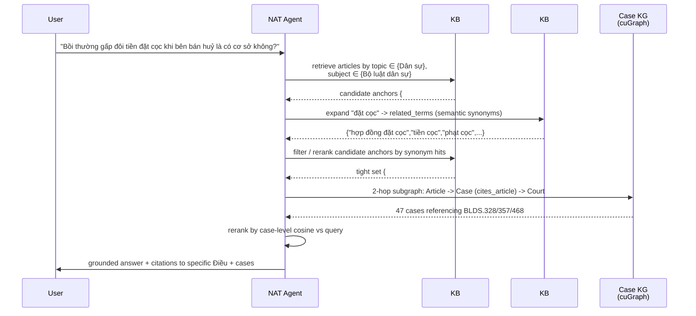
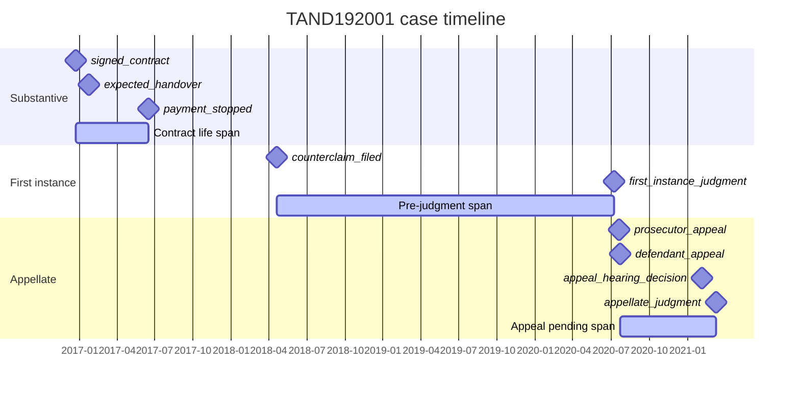

# Analyzing a single Vietnamese legal case (anle / congbobanan)

> Worked-example methodology for one case, end-to-end:
> **document-level coarse-to-fine** → **term-level NER coarse-to-fine** →
> **knowledge graph + GraphRAG (TODO)** → **timeline (TODO)**.
>
> Every entity is classified **coarse-to-fine** using **two Vietnamese-
> legal knowledge bases in priority order**:
>
> 1. **PRIMARY — Bộ Pháp Điển (`tmquan/phapdien-moj-gov-vn`)**: 64,464
>    codified articles + 42 topics + 202 đề mục + 116-row glossary.
>    This is the **official codification published by the Ministry of
>    Justice** — the authoritative source of *which Điều of which Bộ
>    luật* a citation resolves to. Every legal claim grounds out here.
> 2. **SECONDARY — Thuật ngữ pháp lý (`tmquan/thuvienphapluat-vn-tnpl`)**:
>    16,247 bilingual legal terms + 47 areas (lĩnh vực) + 6 broad domains.
>    Community-contributed reference dictionary. Drives the *semantic
>    gloss* layer — synonym expansion, broad-domain bucketing, fall-
>    back classification when phapdien returns no anchor.
>
> The running example throughout this document is
> [`TAND192001`](data/anle.toaan.gov.vn/hf/raw/jsonl/TAND192001.jsonl) —
> a `phúc thẩm` civil judgment ("Tranh chấp Hợp đồng đặt cọc") by
> TAND TP Cần Thơ, code `38/2021/DS-PT`.

---

## 0. TL;DR — the five tables you read

| Priority | Source | Rows | Used for | Local path |
|---|---|---:|---|---|
| input | anle / congbobanan case (one row) | 1 | input | `data/<site>/hf/documents-*.parquet` row OR `md/<doc>.md` + `md/<doc>.meta.json` |
| **KB #1** | **phapdien `articles`** | **64,464** | **structural NER (`Điều N → article_anchor`) + topic / subject** | `data/phapdien.moj.gov.vn/hf/articles-*.parquet` |
| **KB #1** | **phapdien `ontology_*`** | 42 + 202 + 116 | label vocabulary + VI↔EN mapping + instrument glossary | `data/phapdien.moj.gov.vn/hf/ontology_*.parquet` |
| KB #2 | tnpl bilingual terms | 16,247 | semantic gloss + synonym expansion + broad domain | `data/thuvienphapluat_vn_tnpl/hf/data/terms_translated-*.jsonl` |
| KB #2 | tnpl taxonomy | 47 areas (lĩnh vực) | semantic label vocabulary | `data/thuvienphapluat_vn_tnpl/hf/taxonomy.json` |

The full case-analysis output is **one structured JSON bundle per case**
plus two corpus-wide parquet tables (rolled-up rows):

```text
data/<site>/classified/
  manifest.json
  doc-classification-*.parquet      one row per case  (doc-level fields)
  entity-classification-*.parquet   one row per entity (NER + KB linkages)
  by-doc/<doc_name>.json            human-readable join of the above per case
```

### 0.1 Naming convention — English-first keys, bilingual values

Every published parquet table — both upstream
(`phapdien.moj.gov.vn/hf/`, `vbpl.vn/hf/`, `anle.toaan.gov.vn/hf/`,
`thuvienphapluat_vn_tnpl/hf/`) and the analysis outputs in this
document — uses **ASCII English snake_case** column stems, per
`wiki.md` §3.4. Vietnamese appears only inside the right-hand half
of deliberate `*_vi` / `*_en` bilingual *value* pairs:

| Vietnamese concept | Column stem (English) | Bilingual value fields |
|---|---|---|
| chủ đề (broad legal topic, 42 of them) | `topic` | `topic_title_vi`, `topic_title_en` |
| đề mục (consolidated act, 271 of them; LCSH-style subject heading) | `subject` | `subject_title_vi`, `subject_title_en` |
| lĩnh vực (legal domain, 47 in tnpl) | `area` | `area_name_vi`, `area_name_en` |

Concretely throughout this document:

- Doc-level keys: `phapdien_topic_top_k`, `phapdien_subject_top_k`, `tnpl_area_top_k`.
- Entity-level keys: `phapdien_topic_vi/en`, `phapdien_subject_vi/en`.
- KG node types: `Topic` *(chủ đề)*, `Subject` *(đề mục)*, `Area` *(lĩnh vực)*.
- KG edges: `belongs_to_subject`, `is_about_subject`, `is_about_area`.

Upstream and analysis schemas now share the same column stems, so a
read-rename layer is no longer needed (`row["subject_title"]` works
on both sides). The HF-published file names follow the same rule:
`subjects.parquet`, `ontology_subjects.parquet`. Vietnamese prose
mentions (*đề mục*, *chủ đề*, *lĩnh vực*) and Vietnamese value strings
are preserved verbatim — only the *key names* are English-ified.

---

## 1. Pipeline at a glance

```mermaid
flowchart LR
    A[case .jsonl<br/>or md+meta] --> B[Doc-level extractor]
    A --> C[Entity-level extractor]
    B -->|title + subject + first sentences| B1[MPNet embed]
    B1 --> B2{cosine top-K}
    B2 --> P_subject[KB #1 phapdien<br/>202 subject titles encoded]
    B2 --> T[KB #2 tnpl<br/>16,247 terms x 768-d]
    P_subject --> Btop[Topic top-K<br/>42-class]
    P_subject --> Bsubject[Subject top-K<br/>202-class]
    T --> Barea[Area top-K<br/>47-class semantic]
    T --> Bcat[Broad domain<br/>6-class semantic]
    C --> Edate[DATE -> ISO]
    C --> Ecourt[ORG-COURT -> level + juris]
    C --> Eart[ARTICLE]
    C --> Eprec[PRECEDENT]
    Eart -->|article_no + statute_code| L[KB #1 phapdien<br/>structural lookup<br/>(code, N) -> article_anchor]
    L --> L2[topic + subject<br/>via article row]
    Eart --> G[KB #1 phapdien glossary<br/>instrument VI -> EN]
    Eart --> Tlk[KB #2 tnpl<br/>statute -> broad_domain<br/>fallback gloss]
    Btop --> O[(by-doc JSON bundle)]
    Bsubject --> O
    Bcat --> O
    Barea --> O
    Edate --> O
    Ecourt --> O
    L --> O
    L2 --> O
    G --> O
    Tlk --> O
    Eprec --> O
```

The encoder is **`sentence-transformers/paraphrase-multilingual-mpnet-base-v2`**
(768-D, 128-token window) — the same model the tnpl analytics tier
uses, so the two embedding spaces are commensurable and cosines are
directly comparable across KBs.

---

## 2. Input: one case

### 2.1 anle (canonical) — parquet row

The `documents-00000-of-00001.parquet` shipped at
[`tmquan/anle-toaan-gov-vn`](https://huggingface.co/datasets/tmquan/anle-toaan-gov-vn)
already carries every column we need for the doc-coarse layer:

| Column | Example value (TAND192001) |
|---|---|
| `doc_name` | `TAND192001` |
| `doc_code` | `38/2021/DS-PT` |
| `doc_type` | `ban_an` |
| `case_type` | `dan_su` |
| `doc_subtype` | `phuc_tham` |
| `court_level` | `tinh` |
| `jurisdiction` | `CẦN THƠ` |
| `year` | `2021` |
| `issue_date` | `2021-03-11` |
| `issuing_body` | `TÒA ÁN NHÂN DÂN THÀNH PHỐ CẦN THƠ` |
| `title` | `Bản án số: 38/2021/DS-PT` |
| `subject` | `Tranh chấp hợp đồng đặt cọc` |
| `markdown` | full body, ~18 KB |
| `extracted_json` | `{entities[48], statute_refs[11], relations[]}` |
| `structure_json` | 5-section canonical template |

```python
import pyarrow.parquet as pq
docs = pq.read_table("data/anle.toaan.gov.vn/hf/documents-00000-of-00001.parquet")
case = {c: docs.column(c)[0].as_py() for c in docs.column_names if docs.column(c)[0].as_py() is not None}
```

### 2.2 congbobanan (raw) — markdown + per-doc meta

`congbobanan` ships parsed markdown per case under
`data/congbobanan.toaan.gov.vn/md/<id>.md` with a sibling
`<id>.meta.json` that already carries the portal-level metadata
(`doc_type`, `ban_an_so`, `ngay`, `quan_he_phap_luat`, `cap_xet_xu`,
`loai_vu_viec`, `toa_an_xet_xu`, …). For congbobanan you have to run
the **same regex entity extractor inline** because there is no
canonical `extracted_json` yet (see §4.6).

---

## 3. Document-level extraction (coarse → fine)

### 3.1 Layers

| Layer | What | Source | Card |
|---|---|---|---:|
| L0 | `doc_type` | anle metadata | 2-class |
| L1 | `case_type` | anle metadata | 6-class |
| L2 | `doc_subtype` | anle metadata | 4-class |
| L2 | `court_level`, `jurisdiction`, `year`, `issuing_body`, `issue_date` | anle metadata | 4 / 23 / int / 37 / date |
| **L3 (primary)** | `phapdien_topic_top_k` | KB #1 phapdien đề-mục encoder vote | **42-class** official topics |
| **L4 (primary)** | `phapdien_subject_top_k` | KB #1 phapdien đề-mục cosine top-K | **202-class** official subjects (đề mục) |
| **L5 (secondary)** | `tnpl_broad_domain` | KB #2 tnpl vote | **6-class** (Civil / Criminal / Judicial / Commercial / Administrative / Other) |
| **L6 (secondary)** | `tnpl_area_top_k` | KB #2 tnpl vote | **47-class** semantic areas (lĩnh vực) |
| **L6 (secondary)** | `tnpl_term_top_k` | KB #2 tnpl cosine top-K | open-vocabulary semantic terms |

L0-L2 are **passthrough** from the canonical anle metadata. L3-L4 are
the *new authoritative* contribution: classification against the
official Bộ Pháp Điển ontology. L5-L6 are the *secondary gloss* from
the community-curated tnpl thesaurus, useful for synonym expansion and
as a sanity cross-check against the phapdien decision.

### 3.2 The doc embedding

The 128-token MPNet window is too tight to hold a 18-KB judgment, so we
build a **representative-text** string from the structured headings the
case ships with — the same trick the tnpl card uses to keep its
auto-translator faithful to the source even when the body is long:

```text
DOC_REPR = title + ". " + subject + ". " + first_N_sentences
       = "Bản án số: 38/2021/DS-PT. Tranh chấp hợp đồng đặt cọc. "
         + sentence_1 + ". " + sentence_2 + ... + sentence_N
```

with `N = 8` by default (the canonical `sentences-*.parquet` already
provides `global_index` so we can pick the first eight without re-
parsing markdown). The string is `unicodedata.NFC`-normalised and
whitespace-collapsed before encoding (mirroring the tnpl analytics
preprocessing).

### 3.3 The phapdien vote — KB #1 (official codification layer)

This is the *primary* signal: it grounds the case against the official
codification published by the Ministry of Justice.

Encoding 64k phapdien articles is overkill for doc-level intent; the
**42 topic titles + 202 đề-mục titles** are sufficient and cost just
244 MPNet calls (~3 s on CPU):

```text
subject_embeds : (202, 768)   from "<topic_title_vi> > <subject_title_vi>"
doc_embed      : (768,)       from DOC_REPR
sims_subject   : doc_embed @ subject_embeds.T          -> (202,)
top_subject    : argpartition(-sims_subject, K=5)[:5]  -> 5 subjects (đề mục)
top_topic      : majority over top_subject.topic_id    -> 42-class topic
```

For `TAND192001` the expected dominant đề mục are (contract dispute
touching land transfer):

```text
phapdien_subject_top_k = [
  { subject_title_vi: "Bộ luật dân sự",        subject_title_en: "Civil Code",  topic_number: 9,  ...},
  { subject_title_vi: "Luật đất đai",          subject_title_en: "Land Law",    topic_number: 21, ...},
  { subject_title_vi: "Bộ luật tố tụng dân sự", subject_title_en: "Civil Procedure Code",
                                                                                topic_number: 37, ...},
]
phapdien_topic_top_k = [
  { topic_number: 9,  topic_title_vi: "Dân sự",                              topic_title_en: "Civil" },
  { topic_number: 37, topic_title_vi: "Tố tụng và các phương thức giải quyết tranh chấp",
                                                                             topic_title_en: "Litigation and alternative dispute resolution" },
]
```

### 3.4 The tnpl vote — KB #2 (semantic gloss layer)

This is the *secondary* signal: it bucket the case into a
community-curated bilingual thesaurus (broad domain + 47 areas)
useful for synonym expansion downstream and as a cross-check that the
phapdien decision is in the same neighbourhood.

```text
tnpl_embeds  : (16247, 768)   from (term_name_vi + ": " + definition_vi)
sims         : doc_embed @ tnpl_embeds.T            -> (16247,)
top_terms    : argpartition(-sims, K=5)[:5]         -> 5 tnpl rows
area_votes   : sum cosine grouped by area_id        -> top-5 areas (lĩnh vực)
broad_domain : majority over area_votes via
               packages.datasites.thuvienphapluat_tnpl.viz._TOPIC_CATEGORY
               (the canonical 47 -> 6 map used by the tnpl sunburst)
```

For `TAND192001` the expected ranking is dominated by:

```text
tnpl_area_top_k = [
  {area_id: 10, area_name_vi: "Dân sự",            area_name_en: "Civil",                            ...},
  {area_id: 13, area_name_vi: "Đất đai – Nhà ở",   area_name_en: "Land and housing",                 ...},
  {area_id: 20, area_name_vi: "Hôn nhân – Gia đình ...", area_name_en: "Marriage, family and inheritance", ...},
]
tnpl_broad_domain_vi = "Dân sự"    tnpl_broad_domain_en = "Civil"
```

### 3.5 Output schema (one row per case)

| Column | Type | Source |
|---|---|---|
| `doc_name` | str | join key |
| `doc_type`, `case_type`, `doc_subtype` | str | passthrough |
| `court_level`, `jurisdiction`, `year`, `issue_date`, `issuing_body`, `doc_code`, `title`, `subject` | various | passthrough |
| `phapdien_topic_top_k` | json | **L3 — primary** |
| `phapdien_subject_top_k` | json | **L4 — primary** |
| `phapdien_primary_topic_number`, `phapdien_primary_topic_vi`, `phapdien_primary_topic_en` | int/str/str | **primary doc-level label** — topic+subject majority winner |
| `tnpl_broad_domain_vi`, `tnpl_broad_domain_en` | str | L5 — secondary |
| `tnpl_broad_domain_score`, `tnpl_broad_domain_margin` | float | L5 — secondary |
| `tnpl_area_top_k` | json | L6 — secondary |
| `tnpl_term_top_k` | json | L6 — secondary |

---

## 4. Term-level NER (coarse → fine)

### 4.1 Sources of entities

For **anle**, `extracted_json.entities` is already populated by the
`extract` stage (corpus-wide tag distribution: `DATE` 79,532; `ARTICLE`
34,355; `ORG-COURT` 28,643; `PRECEDENT` 75). For **congbobanan** the
extractor has not run yet, so we apply the inline regex pass in §4.6.

### 4.2 DATE — temporal entity (1-step)

Coarse tag: `DATE`. Fine: ISO-parsed date + year + decade. No KB lookup
needed.

```python
RE_DATE = re.compile(
    r"(?:ngày\s+)?(\d{1,2})[/-](\d{1,2})[/-](\d{2,4})|"
    r"ngày\s*(\d{1,2})\s*tháng\s*(\d{1,2})\s*năm\s*(\d{4})", re.I,
)
```

TAND192001 sample → `"23/12/2016"` → `{iso_date: "2016-12-23", year: 2016, decade: 2010}`.

### 4.3 ORG-COURT — court entity (1-step + KB #1 glossary lookup)

Coarse tag: `ORG-COURT`. Fine: `court_level` ∈ {`huyen`, `tinh`,
`cap_cao`, `toi_cao`} + extracted `jurisdiction` (province/city).
Canonical English name comes from phapdien `ontology_glossary` rows
with `category == "court"`.

```python
COURT_LEVEL_KEYWORDS = [
    (r"tối\s*cao",       "toi_cao"),
    (r"cấp\s*cao",       "cap_cao"),
    (r"tỉnh|thành\s*phố(?!\s*trực)", "tinh"),
    (r"huyện|quận|thị\s*xã", "huyen"),
]
```

TAND192001 sample → `"TÒA ÁN NHÂN DÂN THÀNH PHỐ CẦN THƠ"`
→ `{court_level: "tinh", jurisdiction: "CẦN THƠ",
court_name_en: "People's Court of Cần Thơ City"}` (the English label
joined from phapdien glossary).

### 4.4 ARTICLE — the coarse-to-fine showcase (phapdien-first)

ARTICLE entities are where the dual-KB chain matters most. The chain
**leads with phapdien** — every step that can be answered by the
official codification is, and only the residual semantic gloss falls
back to tnpl.

```text
ENTITY TEXT     "Điều 468"
ENTITY CONTEXT  "...lãi suất quy định tại Điều 357, Điều 468 của Bộ luật Dân sự năm 2015..."
                                                              <-------- ±200 char window -------->

L1  parse         article_number = 468,  clause = None
                  (purely structural — regex over the surface form)

L2  statute       statute_code = "BLDS"
                  (matched in the context window against STATUTE_PATTERNS,
                   longest pattern first so "Bộ luật tố tụng dân sự" beats "Bộ luật dân sự")

L3  statute kb    statute_name_vi = "Bộ luật dân sự"
                  statute_name_en = "Civil Code"
                  (canonical bilingual name from the STATUTE_NAMES table)

L4  PHAPDIEN      phapdien_article_anchor  = "#..."                  [PRIMARY RESOLUTION]
    structural    (looked up in the (statute_code, article_number) index
    lookup        built once over phapdien.articles.source_note_text;
    (primary)     see code below)
                  phapdien_topic_number    = 9
                  phapdien_topic_vi        = "Dân sự"
                  phapdien_topic_en        = "Civil"
                  phapdien_subject_vi      = "Bộ luật dân sự"
                  phapdien_subject_en      = "Civil Code"

L5  tnpl gloss    statute_broad_domain_vi = "Dân sự"   [SECONDARY — cross-check]
    (auxiliary)   statute_broad_domain_en = "Civil"
                  (cross-checks the phapdien topic against the 6-class
                   tnpl broad-domain bucket via STATUTE_NAMES; if
                   statute_code is None, falls back to cosine match
                   against tnpl term embeddings)

L6  PHAPDIEN      instrument_vi = "Bộ luật"        instrument_en = "Code"
    glossary      (from phapdien.ontology_glossary, category="instrument")
```

The **phapdien `source_note_text` → article_anchor** index is built
once at startup. This is the single most important data structure in
the entity-level pipeline:

```python
# Each phapdien article cites its source statute and source-article
# number inside source_note_text, e.g.
#   "(Điều 1 Luật số 32/2004/QH11 An ninh Quốc gia ngày 03/12/2004 của Quốc hội ...)"
# We parse that into (statute_code, source_article_number) and bucket.
RE_SRC = re.compile(
    r"\(\s*Điều\s+(\d+)\s+(?:Luật\s+số\s+\S+\s+|Luật\s+|Bộ\s*luật\s+|"
    r"Nghị\s*định\s+|Thông\s*tư\s+|Pháp\s*lệnh\s+)([^,)]+)", re.I,
)
phapdien_index: dict[tuple[str, int], list[dict]] = defaultdict(list)
for row in phapdien_articles:
    m = RE_SRC.search(row["source_note_text"] or "")
    if not m: continue
    src_article_number = int(m.group(1))
    src_statute = m.group(2).strip()
    code = statute_name_to_code(src_statute)        # "Bộ luật dân sự" -> "BLDS"
    if code:
        phapdien_index[(code, src_article_number)].append({
            "article_anchor": row["article_anchor"],
            "topic_number":   row["topic_number"],
            "topic_title":    row["topic_title"],
            "subject_title":  row["subject_title"],
        })
```

When the same `(BLDS, 468)` key is queried by an anle ARTICLE entity,
we get back every codification anchor — typically 1 entry, sometimes a
short list (cross-cited cousins). The first hit's `topic_*` and
`subject_*` propagate up into the entity row.

### 4.5 PRECEDENT — Án-lệ-only (1-step)

Coarse tag: `PRECEDENT`. Fine: `precedent_number`, `precedent_year`
parsed from "Án lệ số N/YYYY/AL". Cross-link target = the
[`documents`](https://huggingface.co/datasets/tmquan/anle-toaan-gov-vn)
row with matching `precedent_number`. (Useful only on `an_le` docs
since `nguonanle` source materials don't carry a number.)

### 4.6 Inline entity extraction for congbobanan

The same regexes that drive §4.2-4.5 run as a single pass over the
markdown body when no `extracted_json` is present:

```python
ENTITY_PATTERNS = [
    ("DATE",       RE_DATE),
    ("ARTICLE",    RE_ARTICLE),           # Điều N (+ optional khoản/điểm)
    ("ORG-COURT",  RE_TAND_VARIANTS),     # TOÀ?\s*ÁN\s*NHÂN\s*DÂN ...
    ("PRECEDENT",  RE_PRECEDENT),
]

def extract_entities(markdown: str) -> list[dict]:
    out = []
    for tag, pat in ENTITY_PATTERNS:
        for m in pat.finditer(markdown):
            out.append({"tag": tag, "text": m.group(0),
                        "start": m.start(), "end": m.end()})
    return out
```

This is intentionally identical to what the canonical `extract` stage
emits, so the downstream NER and KB-linkage code is shared verbatim
between anle and congbobanan. Note: the phapdien lookup chain in §4.4
works the same way on both sites — congbobanan ARTICLE entities will
also resolve to phapdien `article_anchor`s.

### 4.7 Output schema (one row per entity)

| Column | Type | Tags it's populated for |
|---|---|---|
| `doc_name`, `entity_index`, `tag`, `text`, `start`, `end` | str/int | all |
| `entity_role` ∈ {temporal, court, legal_reference, precedent} | str | all |
| `iso_date`, `year_entity`, `decade_entity` | date/int | DATE |
| `court_level_entity`, `jurisdiction_entity`, `court_name_en` | str | ORG-COURT |
| `article_number`, `clause`, `point` | int/str | ARTICLE |
| `statute_code`, `statute_name_vi`, `statute_name_en` | str | ARTICLE |
| **`phapdien_article_anchor`** | str | **ARTICLE (L4 — primary resolution)** |
| **`phapdien_topic_number`, `phapdien_topic_vi`, `phapdien_topic_en`** | int/str | **ARTICLE (L4 — primary resolution)** |
| **`phapdien_subject_vi`, `phapdien_subject_en`** | str | **ARTICLE (L4 — primary resolution)** |
| `statute_broad_domain_vi`, `statute_broad_domain_en` | str | ARTICLE (L5 — secondary tnpl cross-check) |
| `instrument_vi`, `instrument_en` | str | ARTICLE (L6 — phapdien glossary) |
| `precedent_number_entity`, `precedent_year_entity` | int | PRECEDENT |

---

## 5. Worked example — `TAND192001`

What the **doc-level** classifier writes (illustrative; phapdien block
leads, tnpl block follows):

```jsonc
{
  "doc_name": "TAND192001",
  "doc_type": "ban_an",          "case_type": "dan_su",
  "doc_subtype": "phuc_tham",    "court_level": "tinh",
  "jurisdiction": "CẦN THƠ",     "year": 2021,
  "issue_date": "2021-03-11",
  "issuing_body": "TÒA ÁN NHÂN DÂN THÀNH PHỐ CẦN THƠ",
  "doc_code": "38/2021/DS-PT",
  "title": "Bản án số: 38/2021/DS-PT",
  "subject": "Tranh chấp hợp đồng đặt cọc",

  // L3-L4 — PRIMARY phapdien (official Bộ Pháp Điển)
  "phapdien_primary_topic_number": 9,
  "phapdien_primary_topic_vi": "Dân sự",
  "phapdien_primary_topic_en": "Civil",
  "phapdien_topic_top_k": [
    { "topic_number": 9,  "topic_title_vi": "Dân sự",                                       "topic_title_en": "Civil",                                       "score": 0.71 },
    { "topic_number": 37, "topic_title_vi": "Tố tụng và các phương thức giải quyết tranh chấp", "topic_title_en": "Litigation and alternative dispute resolution", "score": 0.52 }
  ],
  "phapdien_subject_top_k": [
    { "subject_title_vi": "Bộ luật dân sự",       "subject_title_en": "Civil Code",          "topic_number": 9,  "score": 0.74 },
    { "subject_title_vi": "Luật đất đai",         "subject_title_en": "Land Law",            "topic_number": 21, "score": 0.55 },
    { "subject_title_vi": "Bộ luật tố tụng dân sự", "subject_title_en": "Civil Procedure Code", "topic_number": 37, "score": 0.49 }
  ],

  // L5-L6 — SECONDARY tnpl (community thesaurus, cross-check + synonym expansion)
  "tnpl_broad_domain_vi": "Dân sự", "tnpl_broad_domain_en": "Civil",
  "tnpl_broad_domain_score": 1.84,  "tnpl_broad_domain_margin": 0.61,
  "tnpl_area_top_k": [
    { "area_id": 10, "area_name_vi": "Dân sự",                  "area_name_en": "Civil",                          "score": 0.79 },
    { "area_id": 13, "area_name_vi": "Đất đai – Nhà ở",         "area_name_en": "Land and housing",               "score": 0.62 },
    { "area_id": 20, "area_name_vi": "Hôn nhân – Gia đình ...", "area_name_en": "Marriage, family and inheritance","score": 0.43 }
  ]
}
```

A single **entity row** (ARTICLE `"khoản 2, Điều 468"` with the
`khoản 2, Điều 468 Bộ luật Dân sự 2015` context near offset 7,587):

```jsonc
{
  "doc_name": "TAND192001", "entity_index": 38,
  "tag": "ARTICLE", "text": "khoản 2, Điều 468", "start": 7587, "end": 7604,
  "entity_role": "legal_reference",

  // L1-L2 — surface parse
  "article_number": 468, "clause": 2, "point": null,
  "statute_code": "BLDS",

  // L3 — statute kb (canonical bilingual name)
  "statute_name_vi": "Bộ luật dân sự",       "statute_name_en": "Civil Code",

  // L4 — PRIMARY phapdien structural resolution
  "phapdien_article_anchor":  "#09xx...XX",
  "phapdien_topic_number":    9,
  "phapdien_topic_vi":        "Dân sự",       "phapdien_topic_en":  "Civil",
  "phapdien_subject_vi":      "Bộ luật dân sự", "phapdien_subject_en": "Civil Code",

  // L5 — SECONDARY tnpl gloss (cross-check)
  "statute_broad_domain_vi":  "Dân sự",       "statute_broad_domain_en": "Civil",

  // L6 — phapdien glossary
  "instrument_vi": "Bộ luật", "instrument_en": "Code"
}
```

The exact `phapdien_article_anchor` value comes from looking up the
`(BLDS, 468)` key in the index built over phapdien's
`source_note_text` (§4.4).

---

## 6. TODO — Knowledge graph + GraphRAG

> Goal: turn the per-case JSON bundles produced in §5 into a single
> queryable property graph over the whole anle + congbobanan corpus,
> with **phapdien as the structural backbone** (every legal claim
> grounds to a phapdien `article_anchor`) and **tnpl as the semantic
> overlay** (synonym expansion, fallback broad-domain). Then let an
> LLM agent reason over that graph via subgraph-grounded retrieval.

### 6.1 Node types

| Node | Primary key | Source |
|---|---|---|
| `Case` | `doc_name` | anle / congbobanan documents |
| `Court` | `(court_level, jurisdiction, name)` | ORG-COURT entities + phapdien glossary EN names |
| `Person` | `(role, surface_form)` (LSH dedup) | (not yet emitted — needs ORG-PERSON tag) |
| `Statute` | `statute_code` | ARTICLE entities + phapdien glossary `instrument` rows |
| **`Article`** | **`phapdien_article_anchor`** | **KB #1 — phapdien (structural backbone)** |
| **`Topic`** | **`phapdien.topic_id`** | **KB #1 — phapdien (42-class)** |
| **`Subject`** | **`phapdien.subject_id`** | **KB #1 — phapdien (202-class, đề mục)** |
| `Precedent` | `precedent_number` | PRECEDENT entities |
| `LegalTerm` | `tnpl.term_id` | KB #2 — tnpl (semantic overlay) |
| `Area` | `tnpl.area_id` | KB #2 — tnpl (47-class, lĩnh vực) |
| `BroadDomain` | `(vi, en)` from `_TOPIC_CATEGORY` | KB #2 — tnpl (6-class) |

### 6.2 Edge types

| Edge | From | To | Source |
|---|---|---|---|
| `decided_by` | Case | Court | `issuing_body` |
| `presided_by` | Case | Person | (TODO ORG-PERSON) |
| `defendant_of`, `plaintiff_of` | Person | Case | (TODO ORG-PERSON) |
| **`cites_article`** | **Case** | **Article** | **KB #1 — ARTICLE entities resolved via phapdien** |
| `belongs_to_topic` | Article | Topic | KB #1 — phapdien.ontology_subjects |
| `belongs_to_subject` | Article | Subject | KB #1 — phapdien.articles |
| `is_about_topic` | Case | Topic | KB #1 — phapdien L4 vote (primary) |
| `is_about_subject` | Case | Subject | KB #1 — phapdien L4 vote (primary) |
| `cross_ref` | Article | Article | KB #1 — phapdien.related_note_text |
| `is_about_area` | Case | Area | KB #2 — tnpl L6 vote (secondary gloss) |
| `is_about_broad_domain` | Case | BroadDomain | KB #2 — tnpl L5 vote (secondary gloss) |
| `synonym_of` | LegalTerm | LegalTerm | KB #2 — tnpl.related_term_ids |
| `glosses` | LegalTerm | Article | tnpl term ↔ phapdien article via shared area / topic |
| `cites_precedent` | Case | Precedent | PRECEDENT entities |

### 6.3 Persistence (matches the repo's Phase-5 architecture)

| Layer | Store | Index |
|---|---|---|
| Structured metadata (`Case`, `Court`, `Statute`, **`Article`**, **`Topic`**, **`Subject`**) | Postgres | btree, gin on `cites_article`, `is_about_topic` |
| Raw bodies (markdown, JSONL, parser meta) | MongoDB | `doc_name` |
| Dense embeddings (case-level + article-level + tnpl term-level) | Milvus + cuVS GPU | IVF_PQ |
| Graph | cuGraph + cuxfilter | GPU traversals |

### 6.4 GraphRAG — retrieval flow (phapdien-anchored)



The agent never invents an article number — every legal claim is
chained back to a phapdien `article_anchor` and an anle / congbobanan
`doc_name`. The tnpl thesaurus only ever appears as a **query-expansion
helper**, never as a source of authority. (Specified in
[`docs/08-ai-agent.md`](docs/08-ai-agent.md).)

---

## 7. TODO — Timeline construction

> Goal: per-case event timeline + corpus-wide procedural-flow analytics.

### 7.1 Event extraction

The DATE entities produced in §4.2 are *unlabelled* timestamps. Promote
each to a typed event by inspecting the ±60-char left context for one
of these patterns:

| Event type | Left-context keywords (regex, case-insensitive) |
|---|---|
| `issued` | `ngày`, `ban hành` near `bản án`/`quyết định` |
| `filed` | `thụ lý`, `khởi kiện` |
| `hearing` | `xét xử`, `phiên tòa`, `tại phiên` |
| `appealed` | `kháng cáo`, `kháng nghị` |
| `signed_contract` | `ký`, `ký kết` near `hợp đồng` |
| `breached` | `vi phạm`, `không thực hiện` |
| `decided` | `quyết định`, `tuyên` |

For `TAND192001` this yields (deduplicated, ISO-sorted):

| Date | Event | Source span |
|---|---|---|
| 2016-12-23 | `signed_contract` (hợp đồng đặt cọc) | offset 2031 |
| 2017-01-23 | `expected_handover` | offset 2758 |
| 2017-06 | `payment_stopped` | (extracted from prose) |
| 2018-04-20 | `counterclaim_filed` | offset 4921 |
| 2020-07-08 | `first_instance_judgment` (05/2020/DS-ST) | offset 867 |
| 2020-07-21 | `prosecutor_appeal` (03/QĐKNPT-VKS-DS) | offset 14005 |
| 2020-07-24 | `defendant_appeal` | offset 14150 |
| 2021-02-04 | `appeal_hearing_decision` (37/2021/QĐPT-DS) | offset 1300 |
| 2021-03-11 | `appellate_judgment` (38/2021/DS-PT) | offset 295 |

### 7.2 Rendering

Three complementary views ship out of every case. Each event is
annotated with the **phapdien article anchor** that governs it
(primary KB, per §4.4) so the timeline doubles as a procedural-law
audit trail, not just a chronology.

#### 7.2.1 Per-case Gantt (events + durations)

Events are bucketed into the three canonical phases of a Vietnamese
civil case — *substantive* (the underlying contract / dispute life),
*sơ thẩm* (first instance), *phúc thẩm* (appellate). We use Mermaid's
`gantt` diagram (the oldest, most-stable Mermaid diagram type) with
each event rendered as a `milestone` task and each phase-span
rendered as a duration bar:



Milestones mark the instantaneous events; the `*-span` bars
materialise the phase durations that the corpus-wide rollup
(§7.2.3) consumes.

#### 7.2.2 Phapdien anchor table per event

Each event in the Gantt is annotated with the **phapdien article
anchor** that governs it (primary KB, per §4.4) — resolved through
the same `(statute_code, article_number) → article_anchor` index
built in §4.4. The Gantt chart deliberately omits these labels (to
keep it parser-safe across Mermaid versions); they live in the
companion table below so the legally-typed information is preserved:

| Event | VI label | EN label | Phapdien anchor |
|---|---|---|---|
| `signed_contract` | Hợp đồng đặt cọc ký | Deposit contract signed | BLDS Đ.328 (Đặt cọc) |
| `expected_handover` | Hạn chuyển nhượng theo HĐ | Contract handover deadline | BLDS Đ.401 (Hiệu lực HĐ) |
| `payment_stopped` | Bên mua ngừng thanh toán | Buyer halted payment | BLDS Đ.351 (Vi phạm nghĩa vụ) |
| `counterclaim_filed` | Bị đơn phản tố | Defendant counterclaim | BLTTDS Đ.200 (Quyền phản tố) |
| `first_instance_judgment` | Bản án 05/2020/DS-ST | First-instance judgment | BLDS Đ.357, Đ.468 (Lãi suất) |
| `prosecutor_appeal` | VKS kháng nghị 03/QĐKNPT-VKS-DS | Prosecutor appeal | BLTTDS Đ.278 (Kháng nghị) |
| `defendant_appeal` | Bị đơn kháng cáo | Defendant appeal | BLTTDS Đ.271 (Kháng cáo) |
| `appeal_hearing_decision` | QĐ 37/2021/QĐPT-DS | Hearing decision | BLTTDS Đ.290 |
| `appellate_judgment` | Bản án 38/2021/DS-PT | Appellate judgment | BLTTDS Đ.308 (Quyền HĐ phúc thẩm) |

Each row carries the three pieces of data drawn from upstream
artefacts:

1. `event_type` — produced by the §7.1 left-context regex pass.
2. `bilingual_label` — VI surface form + EN gloss (the EN side comes
   from the same MPNet translator the doc-level extractor uses for
   `subject`).
3. **phapdien article anchor** — the procedural / substantive
   article that governs the event. This is what turns the timeline
   from a date-list into a *legally-typed* event log.

#### 7.2.3 Corpus-wide rollup (TODO)

For the [`docs/07-justice-flow.md`](docs/07-justice-flow.md) analytics
tier, the per-case timeline tables are unpivoted into one row per
*phase transition* and aggregated:

| Column | Type | Source |
|---|---|---|
| `doc_name` | str | join key |
| `from_event` | str | e.g. `filed` |
| `to_event` | str | e.g. `first_instance_judgment` |
| `duration_days` | int | `to.iso_date - from.iso_date` |
| `case_type` | str | doc-level passthrough |
| `court_level` | str | doc-level passthrough |
| `phapdien_primary_topic_number` | int | doc-level primary KB signal (§3.3) |
| `phapdien_anchor_from`, `phapdien_anchor_to` | str | event-level primary KB |

Aggregated as boxplots per `(case_type, court_level,
phapdien_primary_topic_number)` cell, this becomes the *justice-flow*
heatmap: how long does a Civil (`topic_number=9`) first-instance
take at a `tinh`-level court vs a `huyen`-level court, etc. Because
each duration is anchored to a phapdien topic, the analytics tier
can answer the same question stratified by *which area of law* —
e.g. land-disputes (`topic_number=21`) typically last longer than
marriage-disputes (`topic_number=11`).

---

## 8. How to run the analysis

### 8.1 Single case (interactive)

```python
from scripts.classify_case import analyze_one_case
bundle = analyze_one_case(site="anle", doc_name="TAND192001")

# PRIMARY signal — phapdien
print(bundle["doc_classification"]["phapdien_primary_topic_vi"])
for ent in bundle["entities"]:
    if ent["tag"] == "ARTICLE" and ent.get("phapdien_article_anchor"):
        print(ent["text"], "->", ent["phapdien_article_anchor"],
              ent["phapdien_topic_vi"], "/", ent["phapdien_subject_vi"])

# SECONDARY signal — tnpl (cross-check)
print(bundle["doc_classification"]["tnpl_broad_domain_vi"])
```

### 8.2 Whole site

```bash
# anle (1,963 cases) — POC scope
python scripts/classify_case.py --site anle

# congbobanan, sample first 500 cases via the inline markdown extractor
python scripts/classify_case.py --site congbobanan \
    --input markdown --limit 500
```

Outputs land under `data/<site>/classified/` per §0. Re-runs are
idempotent: writers skip cases whose `(doc_name, text_hash)` already
have a row.

---

## 9. References

- [`tmquan/phapdien-moj-gov-vn`](https://huggingface.co/datasets/tmquan/phapdien-moj-gov-vn) — **KB #1 (primary)**: 64,464 codified articles + 42 topics + 202 đề mục + 116 glossary.
- [`tmquan/thuvienphapluat-vn-tnpl`](https://huggingface.co/datasets/tmquan/thuvienphapluat-vn-tnpl) — **KB #2 (secondary)**: 16,247 bilingual legal terms.
- [`tmquan/anle-toaan-gov-vn`](https://huggingface.co/datasets/tmquan/anle-toaan-gov-vn) — 1,963 cases, four configs (`documents`, `sentences`, `embed`, `reduce`).
- [`packages/datasites/anle/README.md`](packages/datasites/anle/README.md) — five anle pipelines + on-disk layout.
- [`packages/datasites/thuvienphapluat_tnpl/viz.py`](packages/datasites/thuvienphapluat_tnpl/viz.py) — canonical 47 → 6 broad-domain map (reused verbatim by §3.4).
- [`docs/03-curation-pipeline.md`](docs/03-curation-pipeline.md) — Nemo Curator pipeline-level design.
- [`docs/05-data-infrastructure.md`](docs/05-data-infrastructure.md) — Postgres / Mongo / Milvus + cuVS schemas (KG persistence target).
- [`docs/06-knowledge-graph.md`](docs/06-knowledge-graph.md) — cuGraph + cuxfilter graph layer (KG TODO target).
- [`docs/07-justice-flow.md`](docs/07-justice-flow.md) — Vietnamese criminal-justice decision tree (Timeline TODO target).
- [`docs/08-ai-agent.md`](docs/08-ai-agent.md) — NAT agent spec (GraphRAG TODO target).
