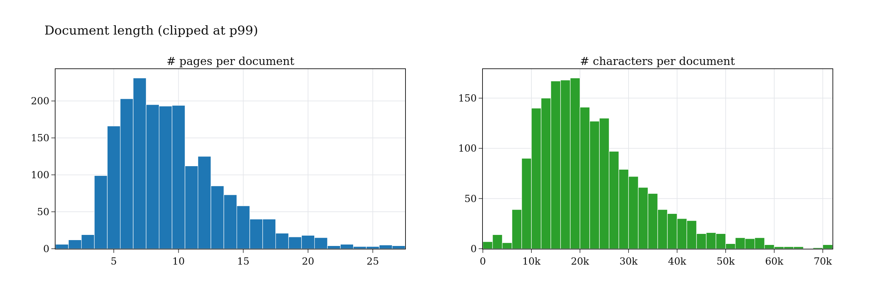
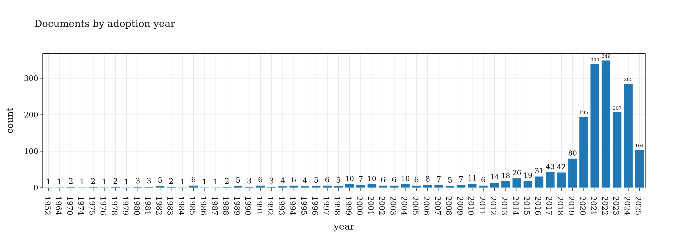
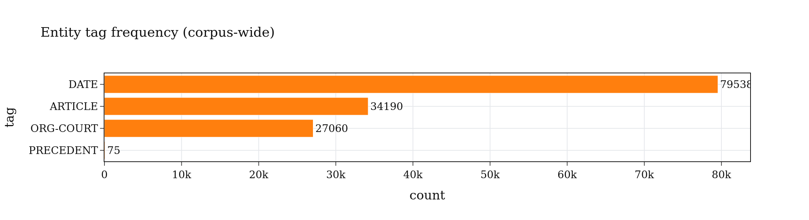
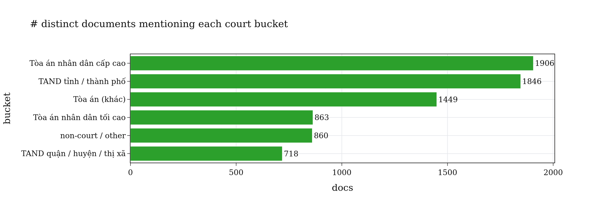
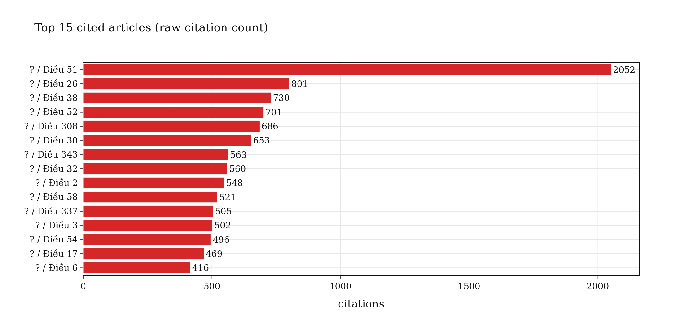
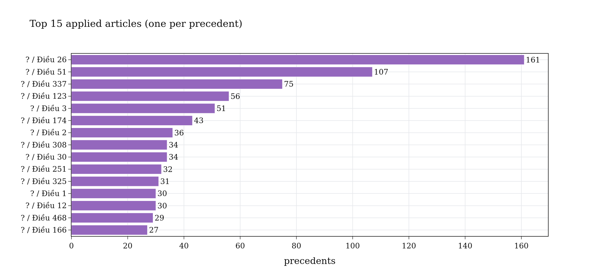
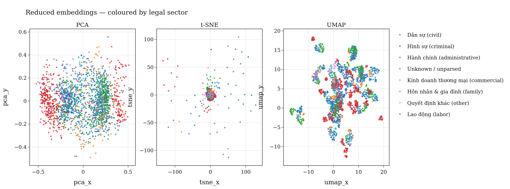
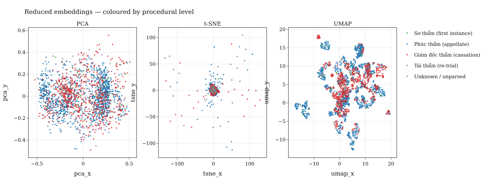
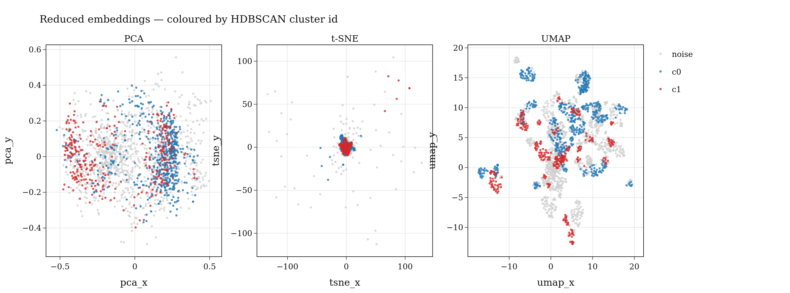

---
language:
- vi
license: cc-by-4.0
pretty_name: "Án lệ — Vietnamese Legal Precedents"
size_categories:
- 1K<n<10K
task_categories:
- text-classification
- text-retrieval
- sentence-similarity
- feature-extraction
tags:
- legal
- vietnamese
- precedent
- anle
- supreme-court
configs:
- config_name: parse
  data_files: data/parse.parquet
- config_name: extract
  data_files: data/extract.parquet
- config_name: embed
  data_files: data/embed.parquet
- config_name: reduce
  data_files: data/reduce.parquet
---

# Án lệ — Vietnamese Legal Precedents

**1 963** case decisions scraped from [`anle.toaan.gov.vn`](https://anle.toaan.gov.vn),
the official Vietnamese Án lệ (legal precedent) portal of the Supreme People's
Court. Each precedent is provided as a **raw PDF**, **parsed markdown**, a
**structured JSON record** (entities, statute references, applied article,
adoption date), a **2 048-dim dense embedding**, and a 2-D projection
(**PCA / t-SNE / UMAP + HDBSCAN cluster id**).

The corpus was produced end-to-end by the
[`packages/datasites/anle`](https://github.com/) NeMo Curator pipeline:

```
download → parse → extract → embed → reduce
```

A self-contained EDA notebook accompanying every figure in this card is
checked in as
[`notebook.ipynb`](https://huggingface.co/datasets/tmquan/anle-toaan-gov-vn/blob/main/notebook.ipynb).

## Quick start

The four configurations mirror the four pipeline stages 1-to-1; pick the
one matching the granularity you need:

```python
from datasets import load_dataset

# parse   — markdown body of every precedent under field `text`
parse   = load_dataset("tmquan/anle-toaan-gov-vn", "parse",   split="train")
# extract — `text` + structured legal extraction (entities, statute refs, applied article …)
extract = load_dataset("tmquan/anle-toaan-gov-vn", "extract", split="train")
# embed   — 2 048-dim dense vectors
embed   = load_dataset("tmquan/anle-toaan-gov-vn", "embed",   split="train")
# reduce  — pre-computed PCA / t-SNE / UMAP coordinates + HDBSCAN cluster id
reduce  = load_dataset("tmquan/anle-toaan-gov-vn", "reduce",  split="train")

print(parse[0]["doc_name"], parse[0]["text"][:80])           # 'TAND192001' '## Page 1\n\n1 …'
print(extract[0]["entities"][:2])                            # [{'tag': 'DATE', 'text': '08/7/2020', …}, …]
print(len(embed[0]["embedding"]))                            # 2048
print(reduce[0])                                             # pca_x/y, tsne_x/y, umap_x/y, cluster_id
```

To download a slice of the raw artefacts:

```python
from huggingface_hub import snapshot_download

# Just the raw PDFs (1.4 GB)
snapshot_download(
    repo_id="tmquan/anle-toaan-gov-vn", repo_type="dataset",
    allow_patterns=["raw/pdf/*.pdf"], local_dir="anle/pdf",
)

# Just the parsed markdown (124 MB)
snapshot_download(
    repo_id="tmquan/anle-toaan-gov-vn", repo_type="dataset",
    allow_patterns=["raw/md/*"], local_dir="anle/md",
)
```

## Configurations

| Config    | Rows  | Stage          | Key columns                                                                 |
|---        |---:   |---             |---                                                                          |
| `parse`   | 1 963 | parse          | `doc_name`, `source`, `detail_url`, `pdf_url`, **`text`**, `num_pages`, `char_len`, `parser_model`, `parsed_at`, `text_hash` |
| `extract` | 1 963 | extract        | `doc_name`, `text_hash`, **`text`**, `entities`, `relations`, `statute_refs`, `adopted_date`, `precedent_number`, `applied_article_*`, `principle_text`, `court` |
| `embed`   | 1 963 | embed          | `doc_name`, `text_hash`, `embedding` (2 048-d float), `embedding_dim`, `embedding_model_id`, `embedding_chunks_used`, `embedding_chunking` |
| `reduce`  | 1 963 | reduce         | `doc_name`, `text_hash`, `pca_x/y`, `tsne_x/y`, `umap_x/y`, `cluster_id`    |

`text` is the markdown body produced by the `parse` stage and copied
verbatim into the `extract` stage. `text_hash` is a deterministic content
hash that joins every config back to the per-doc shards under `raw/`.

## Repo layout

```
README.md                     this dataset card
notebook.ipynb                end-to-end EDA notebook (Plotly, LaTeX-style theme)
data/
  parse.parquet               15 MB · `text` + parse metadata
  extract.parquet             16 MB · `text` + structured extraction
  embed.parquet               23 MB · 2 048-d dense vectors
  reduce.parquet              90 KB · PCA / t-SNE / UMAP + cluster id
assets/                       static PNGs embedded in this README
raw/
  pdf/<doc_name>.pdf          original scraped PDF (1.4 GB total)
  pdf/<doc_name>.url          source detail URL
  md/<doc_name>.md            parsed markdown body
  md/<doc_name>.meta.json     parser metadata sidecar
  jsonl/<doc_name>.jsonl      one-record JSONL extract (mirror of pipeline output)
```

| Bucket       | Files     | Size      |
|---           |     ---:  | ---:      |
| top-level    | 3         | 11 MB     |
| `data/`      | 4         | 54 MB     |
| `assets/`    | 9         | 2.5 MB    |
| `raw/jsonl/` | 1 963     | 77 MB     |
| `raw/md/`    | 3 926     | 124 MB    |
| `raw/pdf/`   | 3 926     | 1.4 GB    |
| **Total**    | **9 832** | **≈ 1.66 GB** |

## Pipeline summary

| Stage      | Reads                                  | Writes                                  | Tooling                                                        |
|---         |---                                     |---                                      |---                                                             |
| `download` | listing on `anle.toaan.gov.vn`         | `pdf/<doc>.pdf` + `.url`                | aiohttp scraper (`AnleDocumentDownloader`)                     |
| `parse`    | `pdf/*.pdf`                            | `md/<doc>.md` + `<doc>.meta.json`       | `nvidia/nemoretriever-parse`                                   |
| `extract`  | `md/*.md`                              | `jsonl/<doc>.jsonl`                     | rule + LLM extractor (entities, statute refs, applied article) |
| `embed`    | `jsonl/*.jsonl`                        | `parquet/embeddings/*.parquet`          | `nvidia/llama-nemotron-embed-1b-v2` (2 048-d, sliding window)  |
| `reduce`   | `parquet/embeddings/*.parquet`         | `parquet/reduced/*.parquet`             | scikit-learn PCA + t-SNE, umap-learn UMAP, HDBSCAN             |

---

# Corpus analysis

The numbers and figures below come from running [`notebook.ipynb`](https://huggingface.co/datasets/tmquan/anle-toaan-gov-vn/blob/main/notebook.ipynb)
end-to-end against this snapshot. They are reproducible from the data shipped
in this repo.

## 1. Pipeline inventory

Every stage of the pipeline produced one artefact per document — no orphans.

| Stage         | # docs |
|---            |  ---:  |
| `pdf/`        | 1 963 |
| `md/`         | 1 963 |
| `jsonl/`      | 1 963 |
| `embeddings/` | 1 963 |
| `reduced/`    | 1 963 |

## 2. Document length

Median precedent: **9 pages / 20 430 characters**. Long-tail goes up to 90 pages
(224 753 characters). The extractor still produces a single record per document
regardless of length.

|         | mean | std  | min  | p50    | p90    | p99    | max     |
|---      | ---: | ---: | ---: | ---:   | ---:   | ---:   | ---:    |
| pages   |  9.7 |  5.3 |  1   |  9     | 15     | 27     | 90      |
| chars   | 23 355 | 14 122 | 1 508 | 20 430 | 38 937 | 72 161 | 224 753 |



## 3. Adoption-year distribution

Adoption dates were parsed from the body of each decision (`adopted_date`)
with **1 933 / 1 963 (98.5%) coverage**. The corpus spans **1952 – 2025**, but
volume is heavily concentrated post-2017 once the formal Án lệ system was
established by the Supreme People's Court.



## 4. Legal-sector breakdown

The **legal sector** of each precedent is parsed from the case-number line at
the top of the body (`Bản án số: <n>/<year>/<SECTOR>-<LEVEL>` or its
`TLPT-<SECTOR>` inverse). Roughly half of the corpus is civil law:

| Legal sector                              | # documents | %    |
|---                                        |        ---: | ---: |
| Dân sự (civil)                            |         886 | 45.1 |
| Hình sự (criminal)                        |         467 | 23.8 |
| Hành chính (administrative)               |         327 | 16.7 |
| Kinh doanh thương mại (commercial)        |          99 |  5.0 |
| Hôn nhân & gia đình (family)              |          43 |  2.2 |
| Quyết định khác (other)                   |          32 |  1.6 |
| Lao động (labor)                          |           8 |  0.4 |
| Unknown / unparsed                        |         101 |  5.1 |

## 5. Procedural level

Most decisions are at the appellate or cassation level — first-instance
judgments are rarely promoted to formal precedents.

| Procedural level                   | # documents | %    |
|---                                 |        ---: | ---: |
| Phúc thẩm (appellate)              |       1 085 | 55.3 |
| Giám đốc thẩm (cassation)          |         690 | 35.1 |
| Sơ thẩm (first instance)           |          65 |  3.3 |
| Tái thẩm (re-trial)                |          18 |  0.9 |
| Unknown / unparsed                 |         105 |  5.4 |

## 6. Entity extraction

The extractor produced **140 863 entity spans** plus **34 190 statute
references**. The relation extractor returned 0 spans on this corpus (the
extractor mostly emits standalone tags, not pairwise relations).

| Tag         | # spans |
|---          |    ---: |
| `DATE`      |  79 538 |
| `ARTICLE`   |  34 190 |
| `ORG-COURT` |  27 060 |
| `PRECEDENT` |      75 |



### 6.1 Court mentions

Each `ORG-COURT` span was bucketed by simple keyword matching. Note that one
document typically mentions several court levels (the lower court that
originally ruled, the appellate court, the cassation court, etc.):

| Bucket                              | # docs mentioning |
|---                                  |              ---: |
| Tòa án nhân dân cấp cao             |             1 906 |
| TAND tỉnh / thành phố               |             1 846 |
| Tòa án (khác)                       |             1 449 |
| Tòa án nhân dân tối cao             |               863 |
| TAND quận / huyện / thị xã          |               718 |
| non-court / other                   |               860 |



### 6.2 Most-cited articles

Top 15 articles by raw citation count across the entire corpus
(`code` is `?` because the source rarely names the parent code in-line; this is
a known limitation of the rule-based extractor):

| Article         | # citations | # documents citing |
|---              |        ---: |               ---: |
| ? / Điều 51     |       2 052 |                455 |
| ? / Điều 26     |         801 |                453 |
| ? / Điều 38     |         730 |                315 |
| ? / Điều 52     |         701 |                222 |
| ? / Điều 308    |         686 |                563 |
| ? / Điều 30     |         653 |                451 |
| ? / Điều 343    |         563 |                560 |
| ? / Điều 32     |         560 |                336 |
| ? / Điều 2      |         548 |                383 |
| ? / Điều 58     |         521 |                144 |
| ? / Điều 337    |         505 |                504 |
| ? / Điều 3      |         502 |                283 |
| ? / Điều 54     |         496 |                163 |
| ? / Điều 17     |         469 |                150 |
| ? / Điều 6      |         416 |                304 |



### 6.3 Applied article (one per precedent)

Each precedent canonically *applies* one article — `applied_article_*` on the
top-level record. Coverage is **99.1 %** (`applied_article_number` is filled
for 1 945 / 1 963 docs); `applied_article_clause` is rarely populated.

| Applied article | # precedents |
|---              |         ---: |
| ? / Điều 26     |          161 |
| ? / Điều 51     |          107 |
| ? / Điều 337    |           75 |
| ? / Điều 123    |           56 |
| ? / Điều 3      |           51 |
| ? / Điều 174    |           43 |
| ? / Điều 2      |           36 |
| ? / Điều 30     |           34 |
| ? / Điều 308    |           34 |
| ? / Điều 251    |           32 |
| ? / Điều 325    |           31 |
| ? / Điều 1      |           30 |
| ? / Điều 12     |           30 |
| ? / Điều 468    |           29 |
| ? / Điều 166    |           27 |



## 7. Embeddings

Every document is embedded by `nvidia/llama-nemotron-embed-1b-v2` into a
2 048-dim dense vector. Long documents are processed with a *sliding* chunking
strategy and the resulting per-chunk vectors are mean-pooled at write time.

| Field                  | Value                                  |
|---                     |---                                     |
| Model                  | `nvidia/llama-nemotron-embed-1b-v2`    |
| Dimension              | 2 048 (float32)                        |
| Chunking               | `sliding`                              |
| Documents              | 1 963                                  |
| L2 norm (mean ± std)   | ≈ 1.00 ± 0.00 (already L2-normalized)  |

## 8. Reduced projections

The `reduce` pipeline writes pre-computed PCA / t-SNE / UMAP coordinates plus
an HDBSCAN cluster id so consumers can plot the corpus without re-running
expensive reducers.

### 8.1 Coloured by legal sector

Civil (blue) and criminal (red) cases form well-separated regions in t-SNE and
UMAP. Administrative cases (green) form a third coherent island. PCA collapses
most of this structure into one axis — useful for fast exploration but visibly
less discriminative.



### 8.2 Coloured by procedural level

Procedural level ("Phúc thẩm" appellate vs. "Giám đốc thẩm" cassation) does
not separate as cleanly as sector — i.e. the embedding space is dominated by
*topic* (which area of law) rather than *court hierarchy*. Cassation cases
nevertheless concentrate in a few sub-regions.



### 8.3 HDBSCAN clusters

HDBSCAN finds two large dense clusters and assigns the rest to "noise":

| Cluster | # docs |
|---      |  ---:  |
| `c0`    |    536 |
| `c1`    |    328 |
| `noise` |  1 099 |

The "noise" label here is HDBSCAN-speak for "below the density threshold" — it
does not mean those documents are uninformative; the corpus simply isn't
strongly bimodal.



---

## How to reproduce

The full publishing flow is one Python script:

```bash
# from the monorepo root
pip install -r packages/datasites/anle/requirements.txt
python data/anle.toaan.gov.vn/_to_hf.py --repo tmquan/anle-toaan-gov-vn
```

`_to_hf.py` does three things in order:

1. **Consolidate** every per-doc shard under `parquet/embeddings/`,
   `parquet/reduced/` and `jsonl/` into the three ZSTD parquet files in
   `data/`. DuckDB is used because PyArrow ≥ 17 occasionally fails on the
   per-doc embedding shards with `Repetition level histogram size mismatch`.
2. **Render** all 9 static plot PNGs in `assets/` and the `_stats.json`
   snapshot embedded in this card (delegates to `_render_assets.py`).
3. **Upload** every artefact to the Hub at the right path. Importantly it
   uses `HfApi.upload_folder(path_in_repo=...)` — never
   `hf upload-large-folder`, which silently puts everything at the repo
   root because it has no `--path-in-repo` flag.

Sub-steps can be skipped with `--skip-consolidate`, `--skip-assets`,
`--no-upload`.

---

## Source & license

The decisions are public legal documents published by the Supreme People's
Court of Vietnam at <https://anle.toaan.gov.vn>. Litigant identifiers in the
source are already abbreviated by the publisher (e.g. *Nguyễn Thị T*).
This redistribution is offered under **CC-BY 4.0** with attribution to
`anle.toaan.gov.vn`. Users are responsible for complying with the original
publisher's terms when reusing the raw PDFs.

## Citation

If you use this dataset, please cite both the original portal and this
redistribution:

```bibtex
@misc{anle_toaan_2026,
  title        = {Án lệ — Vietnamese Legal Precedents},
  author       = {TMQuan},
  year         = {2026},
  howpublished = {\url{https://huggingface.co/datasets/tmquan/anle-toaan-gov-vn}},
  note         = {Mirror of the Án lệ corpus published at https://anle.toaan.gov.vn}
}
```
