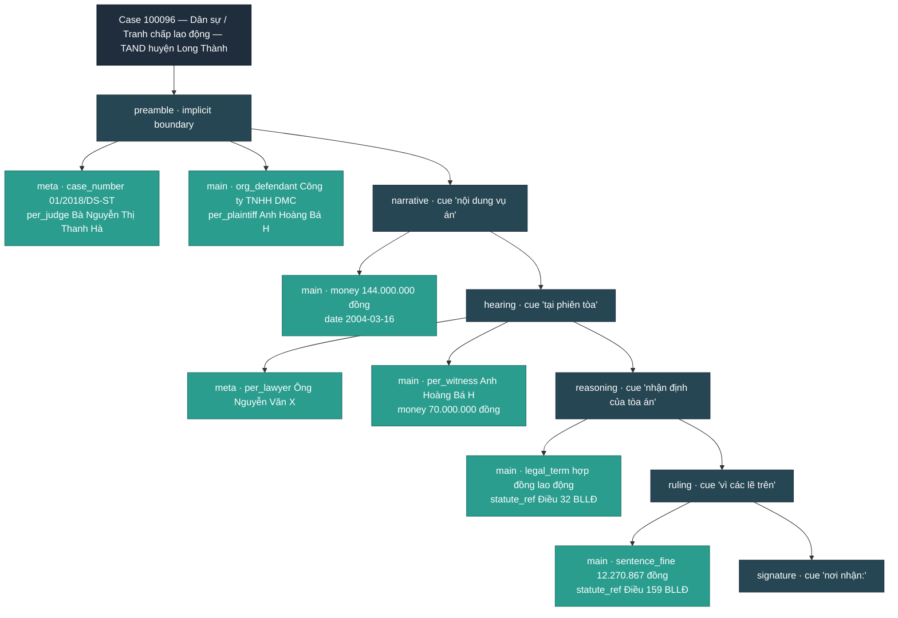

# DEVELOPMENT — case-development arc analytics

Stand-alone spec for `packages/extractor/development/`. The package
projects each ban-án's NER record onto the **procedural-development
arc** of the case — the ordered sequence of macro-structural
phases a Vietnamese court judgment passes through, and the
per-lane (metadata / maindata) entity delta at each phase. No
LLM call; pure deterministic function of the upstream NER cache
record + the source markdown.

This document is the source-of-truth contract. Any change to
schema field names, builder logic, or determinism rules must land
here in the same commit.

The development view is the second of two complementary
projections living under `packages/extractor`:

* `packages/extractor/timeline` — date-anchored event-line view
  (*when* did things happen). See `wiki/TIMELINE.md`.
* `packages/extractor/development` — phase-anchored
  development-arc view (*how* the case develops; which lane of
  information grows in which phase). This wiki.

The two are siblings; neither depends on the other at runtime.

## 1. Goal & non-goals

**Goal** — give analysts a single-screen, lossy-but-faithful
view of *how* each court judgment develops, suitable for audit
trails ("did the prosecutor change between filing and hearing?"),
section-level entity-density analysis ("what new statutes appear
in the reasoning section?"), and procedural-completeness checks
("does this ban-án have an explicit ruling phase?").

**Non-goals**:

* Not an extractor — operates on the existing canonical NER
  cache produced by `packages/extractor/ner` (see
  `wiki/EXTRACTION.md § 4`). No new LLM calls, no new corpus
  reads beyond the source `.md`.
* Not a replacement for the timeline. The two artifacts are
  complementary projections of the same NER record: TIMELINE
  answers *when*, DEVELOPMENT answers *where in the document*.
* Not a perfect classifier — phase boundaries are heuristic
  (cue-driven, ~80–90% accuracy on the 140-doc sample at the
  cue table tuned for the corpus). The schema preserves char
  offsets so downstream tooling can re-segment if needed.

## 2. Two lanes — metadata and maindata

The development record mirrors the NER `metadata` / `maindata`
partition documented in `wiki/EXTRACTION.md § 4`:

| Lane | Vietnamese | Contains | Drives |
|---|---|---|---|
| `metadata` | lịch sử & hậu cần vụ án | `case_number`, `per_judge`, `per_prosecutor`, `per_lawyer`, `per_witness`, `org_court`, `org_agency` | Court-machinery roster |
| `maindata` | nội dung vụ án | Parties (per_*/org_*), locations, dates, money, identifiers, statute_ref, legal_term, crime, sentence_* | Case-content payload |

Each phase carries four entity lists — one per `(lane, delta-status)`
cross-product:

| Field | Meaning |
|---|---|
| `metadata_introduced` | Metadata-lane entities seen here for the first time. |
| `metadata_carried`    | Metadata-lane entities introduced in an earlier phase that reappear here. |
| `maindata_introduced` | Maindata-lane entities seen here for the first time. |
| `maindata_carried`    | Maindata-lane entities introduced earlier that reappear here. |

The "first-time" key is the pair `(entity.type, entity.text)`
after NFC normalisation — exact-match-on-text after
NFC-folding the source. An entity appears in `*_introduced`
exactly once (in its first phase) and in `*_carried` on every
later phase that mentions it again.

The lane partition is computed by calling
`packages.extractor.ner.schema.section_for(entity.type)` on every
located entity, so this module stays exhaustively consistent
with the upstream NER catalogue without any local duplication.

## 3. Phase taxonomy

Seven phases mirror the standard sectional layout of a
Vietnamese ban-án. The segmenter
(`packages/extractor/development/segmenter.py`) scans for the
**first** occurrence of each cue (left-to-right, NFC + lowercase)
and slices the document at those offsets. The cue tables live
at the top of
[`packages/extractor/development/classify.py`](../packages/extractor/development/classify.py)
so the wiki and runtime stay in sync.

| Phase | Vietnamese cue phrases (lowercased, NFC) | Typical entity profile |
|---|---|---|
| `preamble` | *(implicit; always offset 0 → first cue)* | Header card: `case_number`, `org_court`, `per_judge`, `per_prosecutor`, parties listed in the panel. |
| `narrative` | `"nội dung vụ án"` · `"nội dung sự việc"` · `"theo các tài liệu"` · `"diễn biến vụ án"` | Alleged facts: `date`, `per_defendant` / `per_plaintiff` / `per_victim` (and `org_*` variants), `loc_*`, `money`, `crime`, `id_number`. |
| `investigation` | `"cơ quan điều tra"` · `"điều tra viên"` · `"kết luận điều tra"` · `"thụ lý vụ án"` · `"thụ lý sơ thẩm"` · `"cáo trạng"` · `"bản cáo trạng"` | Criminal pre-trial / civil intake: `org_agency`, additional facts, `per_witness` mentions, `case_number` restated. |
| `hearing` | `"tại phiên toà"` · `"tại phiên tòa"` · `"diễn biến phiên toà"` · `"diễn biến phiên tòa"` | In-court session: `per_witness` testimony, `per_lawyer` arguments, restated panel. |
| `reasoning` | `"nhận định của toà án"` · `"nhận định của tòa án"` · `"hội đồng xét xử nhận định"` · `"xét thấy"` | Heavy `legal_term` and `statute_ref` density; no new parties. |
| `ruling` | `"vì các lẽ trên"` · `"quyết định:"` · `"tòa án quyết định"` · `"toà án quyết định"` · `"tuyên xử"` | Operative ruling: `sentence_prison` / `sentence_fine`, `applied_statutes`, costs, appeal window. |
| `signature` | `"thẩm phán -"` · `"thư ký phiên toà"` · `"thư ký phiên tòa"` · `"chủ toạ phiên toà"` · `"chủ tọa phiên tòa"` · `"nơi nhận:"` | Restated court mention, judge signatures. |

Segmenter invariants (pinned by
`tests/unit/test_development_determinism.py::TestSegmenter`):

* The phases list is always a **contiguous sub-sequence** of the
  canonical procedural order
  `(preamble, narrative, investigation, hearing, reasoning,
  ruling, signature)`. Out-of-order cue hits (e.g. a stray
  "nội dung vụ án" appearing after a hearing cue) are dropped.
* Spans are contiguous and non-overlapping:
  `spans[i].char_end == spans[i+1].char_start`, and the union
  covers `[0, len(source))`.
* Signature cues are searched only **after** the latest
  earlier-phase boundary (so an early "Thẩm phán: …" listing
  in the preamble cannot win the signature slot). If no
  earlier boundary fired, the search is restricted to the last
  5% of the document.
* Degenerate fallback: if no cue fires anywhere, the document
  is emitted as a single `preamble` covering `[0, len(source))`.

## 4. Output schema

The full Pydantic walk-through. Field names are pinned by
[`packages/extractor/development/schema.py`](../packages/extractor/development/schema.py);
this section tracks it.

### 4.1 On-disk record

```jsonc
{
  "schema_version":   "v1",          // shape contract
  "builder_version":  "v1",          // algorithm contract

  "doc_name":              "100096",
  "source_cache_key":      "<32-hex>",
  "source_kb_version":     "<16-hex>",
  "source_prompt_version": "v3",
  "source_input_text_hash":"<32-hex>",
  "built_at":              "2026-05-25T00:00:00Z",

  "case_header": CaseHeader,         // static identifiers
  "phases":      [Phase, ...],       // ordered, contiguous arc
  "stats":       DevelopmentStats    // per-phase + total counts
}
```

### 4.2 `CaseHeader`

Inlined into the development record so a consumer rendering
one `CaseDevelopment.json` does not have to join back to the
timeline / NER cache for the case-card identifiers. Derived from
`record.metadata` + `record.summary`.

```jsonc
{
  "case_number":     "01/2018/DS-ST",
  "court":           "Tòa án nhân dân huyện Long Thành",
  "case_type":       "Dân sự / Tranh chấp lao động",
  "primary_offence": null,
  "judges":          ["Bà Nguyễn Thị Thanh Hà", "Bà Mai Thị Huệ"],
  "prosecutors":     ["Bà Lê Thị Hồng Hà"]
}
```

### 4.3 `Phase`

```jsonc
{
  "phase":      "hearing",            // PhaseId literal
  "cue":        "tại phiên tòa",      // matched cue phrase (or null for preamble)
  "char_start": 1649,
  "char_end":   6320,

  "metadata_introduced": [EntityRef, ...],
  "metadata_carried":    [EntityRef, ...],
  "maindata_introduced": [EntityRef, ...],
  "maindata_carried":    [EntityRef, ...]
}
```

Within each of the four lists, entries are sorted
deterministically by `(char_start, type, text)` so the on-disk
JSON bytes are stable across re-runs.

### 4.4 `EntityRef`

```jsonc
{
  "type":            "statute_ref",       // original NER type id
  "text":            "Điều 173 BLHS",
  "char_start":      4231,
  "char_end":        4247,
  "kb_link_anchor":  "#0160100000…",      // statute_ref → phapdien
  "kb_link_term_id": null                 // legal_term → tnpl (int)
}
```

Both KB-link fields are nullable for every other entity type;
they are persisted alongside the mention so the development view
is self-contained — a consumer can render KB-grounded badges
without re-joining to the NER cache.

### 4.5 `DevelopmentStats`

```jsonc
{
  "n_entities_total":       50,
  "n_entities_routed":      38,
  "n_unrouted":             12,    // entities the locator could not place
  "n_phases":                6,

  "n_metadata_introduced":   6,
  "n_metadata_carried":      0,
  "n_maindata_introduced":  32,
  "n_maindata_carried":      0,

  "per_phase": {                   // <phase_id>: entities attached
    "preamble":   16,
    "narrative":   2,
    "hearing":    14,
    "reasoning":   2,
    "ruling":      4,
    "signature":   0
  }
}
```

Note that `per_phase` keys appear only for phases the segmenter
actually emitted, so the dict is also a phase-coverage indicator
for each doc.

## 5. Determinism contract

The pipeline is reproducible by construction. Every output that
reaches disk is a function of the upstream NER cache record
(which is itself deterministic; see `wiki/EXTRACTION.md § 0` for
its determinism contract) and two knobs:

| Knob | Where | Effect |
|---|---|---|
| `BUILDER_VERSION` | `schema.py` | Bumped on any algorithm change. Currently `"v1"`. |
| `built_at` | CLI `--built-at` | Pins the timestamp stamped onto the record. Use a fixed value in CI. |

Re-runs that hold both constant produce **byte-identical**
output. Pinned by:

* `tests/unit/test_development_determinism.py::test_build_development_byte_stable`
* JSON serialisation uses `sort_keys=True, ensure_ascii=False,
  indent=2` — see `build.py::write_development`.

Within each phase, the four delta lists are sorted by
`(char_start, type, text)` so the on-disk bytes are stable
regardless of the NER record's persisted entity order.

## 6. Pipeline shape

```
read entities/canonical/<doc>.json
read md/<doc>.md
            │
            ▼
NFC-normalise source                              (build.py)
            │
            ▼
segment into ordered phase spans                  (segmenter.py)
   cue tables in classify.py
            │
            ▼
locate every NER entity by greedy left-to-right
substring search → char_start / char_end          (build.py)
            │
            ▼
route each located entity into the phase whose
span covers its char_start
   unlocated / out-of-span → unrouted bucket
            │
            ▼
per-phase delta against a running (type, text) set
   first-time key → *_introduced
   already-seen   → *_carried
            │
            ▼
sort each list by (char_start, type, text)
stamp BUILDER_VERSION / SCHEMA_VERSION + upstream
NER cache identifiers
            │
            ▼
write development/<doc>.json (sorted-keys JSON)
            │
            ▼
aggregate developments.jsonl (one row per doc)
```

The development builder is a **sibling** of the timeline builder,
not a child. It re-implements a tiny literal-substring locator
inline (no import from `packages.extractor.timeline.locator`) so
the two packages can evolve independently.

## 7. Reproduction recipe

```bash
# 1. The NER canonical pass must be done first (see EXTRACTION.md):
ls data/samplebanan.toaan.gov.vn/entities/canonical | wc -l   # → 140

# 2. Build developments for every doc with a canonical extraction:
python -m packages.extractor.development \
    --canonical-dir data/samplebanan.toaan.gov.vn/entities/canonical \
    --md-dir        data/samplebanan.toaan.gov.vn/md \
    --output        data/samplebanan.toaan.gov.vn \
    --built-at      2026-05-25T00:00:00Z          # pin for byte-stable rerun

# 3. Outputs:
ls data/samplebanan.toaan.gov.vn/development | wc -l        # → 140 per-doc JSON
ls data/samplebanan.toaan.gov.vn/developments.jsonl         # aggregated stream
```

Re-runs with the same `--built-at` produce byte-identical files.
Drop `--built-at` for ad-hoc runs (the timestamp is the only
non-deterministic field).

CLI flags (`python -m packages.extractor.development --help`):

| Flag | Effect |
|---|---|
| `--canonical-dir DIR` | Canonical NER per-doc records (default from config). |
| `--md-dir DIR` | Source markdown directory. |
| `--output DIR` | Output root; writes `development/` + `developments.jsonl`. |
| `--built-at ISO` | Pin the `built_at` stamp for byte-stable runs. |
| `--limit N` | Stop after N docs (lex order; for smoke runs). |
| `--config PATH` | Override the YAML config. |
| `--log-level LVL` | DEBUG / INFO / WARNING / ERROR. |

## 8. Determinism tests

[`tests/unit/test_development_determinism.py`](../tests/unit/test_development_determinism.py)
(21 tests, no network):

1. **Segmenter** — eight tests pin the contiguous-cover
   contract, the canonical-procedural-order sub-sequence
   contract, missing-cue fallback, out-of-order-cue rejection,
   the empty-source degenerate case, and the cue-text-verbatim
   guarantee.
2. **Byte-stable build** — two builds of the same
   `(record, source_text, built_at)` produce identical
   sorted-key JSON serialisations.
3. **Version stamping** — `schema_version`, `builder_version`,
   and the upstream `source_*` cache identifiers are all
   present on every record.
4. **Delta semantics** — entities introduced in an earlier
   phase appear in `*_carried` (never re-introduced) on later
   phases that mention them; preamble metadata
   (case_number / judge / court / prosecutor) lands in
   `preamble.metadata_introduced`.
5. **Routing** — every routed entity's `char_start` sits
   inside its phase span; the synthetic-source fixture
   produces `n_unrouted = 0`.
6. **Stats round-trip** — sum of `*_introduced` /
   `*_carried` list lengths equals the corresponding
   `stats.n_*` fields; per-phase counts cover every emitted
   phase.
7. **KB grounding** — `statute_ref` and `legal_term`
   attribute pass-through (`kb_link_anchor` / `kb_link_term_id`)
   survives the projection.

All tests run offline; the development package never imports
from `packages.extractor.timeline`, so the two test suites stay
independent.

## 9. Output consumers — recipes

### 9.1 Audit trail (did the panel change between phases?)

```python
import json, pathlib
for line in pathlib.Path("data/samplebanan.toaan.gov.vn/developments.jsonl").read_text().splitlines():
    dev = json.loads(line)
    judges_per_phase = {
        ph["phase"]: [
            r["text"]
            for r in (*ph["metadata_introduced"], *ph["metadata_carried"])
            if r["type"] == "per_judge"
        ]
        for ph in dev["phases"]
    }
    if judges_per_phase.get("preamble") != judges_per_phase.get("hearing"):
        print(dev["doc_name"], judges_per_phase)
```

### 9.2 New statutes in the reasoning section

```python
import json, pathlib
for line in pathlib.Path("data/samplebanan.toaan.gov.vn/developments.jsonl").read_text().splitlines():
    dev = json.loads(line)
    for ph in dev["phases"]:
        if ph["phase"] != "reasoning":
            continue
        new_statutes = [
            r["text"] for r in ph["maindata_introduced"]
            if r["type"] == "statute_ref"
        ]
        if new_statutes:
            print(dev["doc_name"], new_statutes)
```

### 9.3 Tabular flatten (CSV / Pandas)

```python
import json, pathlib, pandas as pd
rows = []
for line in pathlib.Path("data/samplebanan.toaan.gov.vn/developments.jsonl").read_text().splitlines():
    dev = json.loads(line)
    for ph in dev["phases"]:
        for bucket, status in (
            ("metadata_introduced", "introduced"),
            ("metadata_carried",    "carried"),
            ("maindata_introduced", "introduced"),
            ("maindata_carried",    "carried"),
        ):
            for r in ph[bucket]:
                rows.append({
                    "doc": dev["doc_name"],
                    "phase": ph["phase"],
                    "status": status,
                    "lane": "metadata" if bucket.startswith("metadata") else "maindata",
                    "type": r["type"],
                    "text": r["text"],
                    "char_start": r["char_start"],
                })
df = pd.DataFrame(rows)
```

### 9.4 Pairing with the timeline

The two artifacts share `source_cache_key`, so a join is
trivial:

```python
import json, pathlib
tl_by_doc  = {json.loads(l)["doc_name"]: json.loads(l)
              for l in pathlib.Path("data/samplebanan.toaan.gov.vn/timelines.jsonl"
                                    ).read_text().splitlines()}
dev_by_doc = {json.loads(l)["doc_name"]: json.loads(l)
              for l in pathlib.Path("data/samplebanan.toaan.gov.vn/developments.jsonl"
                                    ).read_text().splitlines()}
# Same case_number / court / case_type by construction.
```

## 10. Run results — first canonical pass

First end-to-end build over the 140-doc `samplebanan` corpus,
`builder_version = v1`, against the NER canonical pass at
`prompt_version = v3`.

### 10.1 Headline numbers

| Metric | Value |
|---|---|
| Documents processed | 140 / 140 |
| Wall-clock | < 1 second total |
| Total phases emitted | 757 |
| Mean phases / doc | 5.41 |
| Total entities routed into a phase | 6 969 |
| Total entities unrouted (locator miss or out-of-span) | 1 911 |
| Mean unrouted / doc | 13.6 |
| Total `*_introduced` mentions | 6 933 (`metadata` 1 144 + `maindata` 5 789) |
| Total `*_carried` mentions | 36 |
| Output size | 2.1 MiB per-doc / 1.3 MiB aggregate JSONL |

### 10.2 Phase coverage (docs that emit each phase)

| Phase | Docs | Share |
|---|---|---|
| `preamble` | 140 | 100.0% |
| `narrative` | 103 | 73.6% |
| `investigation` | 11 | 7.9% |
| `hearing` | 116 | 82.9% |
| `reasoning` | 117 | 83.6% |
| `ruling` | 133 | 95.0% |
| `signature` | 137 | 97.9% |

The low `investigation` coverage is a corpus fact, not a
classifier weakness: most criminal ban-án subsume the
investigation into a brief paragraph inside `narrative` (rather
than calling out a separate "Cơ quan điều tra" section), and
civil ban-án only sometimes mention "thụ lý vụ án" as a
heading. The 11 docs that *do* fire an `investigation` phase
are mainly criminal cases that quote "Cơ quan điều tra" /
"Bản cáo trạng" prominently and civil cases with an explicit
"Thụ lý vụ án" subheading.

### 10.3 Phase-count histogram

| Phases / doc | Count |
|---|---|
| 1 | 1 |
| 2 | 1 |
| 3 | 3 |
| 4 | 8 |
| 5 | 53 |
| 6 | 70 |
| 7 | 4 |

The modal doc emits **6 phases** (preamble + 5 of the others;
typically every phase except `investigation`). Four docs emit
the full 7-phase arc — all civil cases that explicitly call
out a "Thụ lý vụ án" intake step plus a "Nội dung vụ án"
narrative section.

### 10.4 Per-phase entity attachment

| Phase | Total entities | `metadata_intro` | `maindata_intro` | `metadata_carried` | `maindata_carried` |
|---|---|---|---|---|---|
| `preamble` | 2 404 | 790 | 1 605 | 0 | 9 |
| `narrative` | 648 | 17 | 626 | 0 | 5 |
| `investigation` | 20 | 1 | 19 | 0 | 0 |
| `hearing` | 1 543 | 109 | 1 427 | 0 | 7 |
| `reasoning` | 892 | 50 | 833 | 0 | 9 |
| `ruling` | 1 208 | 46 | 1 157 | 0 | 5 |
| `signature` | 254 | 131 | 122 | 0 | 1 |

Observations:

* The **preamble** carries the largest entity load (2 404 mentions)
  — the LLM front-loads case-header parties into the
  `metadata`/`maindata` panels, so most entity *first mentions*
  land at the top of the document.
* **Reasoning** and **ruling** are statute-heavy as expected
  (heavy `maindata_introduced`: 833 + 1 157), with relatively
  few new actors (`metadata_introduced`: 50 + 46).
* `*_carried` totals (36 across the corpus) are small because
  the v3 NER pipeline emits each unique `(type, text)` mention
  once, so most entities have only a single locatable
  occurrence. Repeat mentions surface mostly for the court
  (`org_court` reappears in the ruling) and the case number.

### 10.5 Top-10 cue phrases triggered

| Hits | Cue | Phase |
|---|---|---|
| 111 | `"nơi nhận:"` | `signature` |
| 108 | `"tại phiên tòa"` | `hearing` |
| 103 | `"nội dung vụ án"` | `narrative` |
| 102 | `"vì các lẽ trên"` | `ruling` |
| 89 | `"nhận định của tòa án"` | `reasoning` |
| 21 | `"xét thấy"` | `reasoning` |
| 19 | `"quyết định:"` | `ruling` |
| 18 | `"chủ tọa phiên tòa"` | `signature` |
| 12 | `"tuyên xử"` | `ruling` |
| 9 | `"thụ lý vụ án"` | `investigation` |

The corpus is dominated by the modern-orthography `tòa`
spelling (with a regular `o`) over the legacy `toà` form, so
the `"…tòa…"` variants account for the bulk of hits. Both
spellings are kept in the cue tables for resilience.

### 10.6 Worked examples

**`100096` — civil labour dispute (Tòa án nhân dân huyện Long Thành).**
Six-phase arc: preamble → narrative → hearing → reasoning →
ruling → signature. The investigation phase is absent because
this civil case treats "thụ lý vụ án" as a body sentence
rather than a section heading.

| Phase | Cue | meta_intro + main_intro | carry |
|---|---|---|---|
| `preamble` | *(implicit)* | 16 | 0 |
| `narrative` | `"nội dung vụ án"` | 2 | 0 |
| `hearing` | `"tại phiên tòa"` | 14 | 0 |
| `reasoning` | `"nhận định của tòa án"` | 2 | 0 |
| `ruling` | `"vì các lẽ trên"` | 4 | 0 |
| `signature` | `"nơi nhận:"` | 0 | 0 |

**`12722` — criminal theft (Tòa án nhân dân huyện Tiền Hải).**
A compact criminal case. Narrative cue absent — the alleged
facts are folded into the body without a dedicated section
header. Five-phase arc: preamble → hearing → reasoning →
ruling → signature.

| Phase | Cue | meta_intro + main_intro |
|---|---|---|
| `preamble` | *(implicit)* | 19 |
| `hearing` | `"tại phiên tòa"` | 8 |
| `reasoning` | `"xét thấy"` | 8 |
| `ruling` | `"vì các lẽ trên"` | 5 |
| `signature` | `"nơi nhận:"` | 1 |

**`1228588` — civil divorce with custody dispute (full 7-phase arc).**
One of four docs that emit every phase, including
`investigation` (`"thụ lý vụ án"` cue). Useful as a
golden-path reference for downstream consumers.

### 10.7 Known limitations

* **Cue brittleness**: the segmenter is a literal-substring
  scanner. Documents that use non-standard wording (e.g.
  legacy `toà` variants the cue table doesn't cover, or
  rare phrasings) lose the corresponding phase. The cue
  tables in `classify.py` are the single tuning knob.
* **Locator recall**: 21.5% of entities are *unrouted* (1 911
  / 8 880). The locator is purely literal NFC substring
  search — entities the LLM paraphrased through OCR drift,
  re-cased character variants, or whitespace noise miss the
  match. These entities are not lost — they just don't land
  on a phase. They remain available in the upstream NER
  cache record.
* **Single-occurrence collapse**: an entity that genuinely
  appears in three phases (e.g. the court named in the
  preamble, the hearing, and the ruling) is currently mapped
  to its *first* occurrence only by the locator. So
  `*_carried` lists are sparser than the actual document
  semantics imply. This matches the timeline locator's
  behaviour and keeps the two projections consistent.

These are not bugs against the determinism contract — they
are quality knobs for future iterations. Bumping
`BUILDER_VERSION` invalidates downstream caches cleanly when
an iteration ships.

## 11. Sample diagram

A small example of how a `CaseDevelopment` reads as a vertical
phase ribbon. The example is doc `100096` (the civil labour
dispute from § 10.6); the per-phase callouts are the top-2
*introduced* entities of each lane.



The ribbon reads top-to-bottom: each `phase` node is followed by
its `metadata` / `maindata` *introduced* callouts. A more
graphics-oriented consumer can substitute its own renderer
(vis-timeline-style swimlanes, Sankey diagrams from
`*_introduced` → `*_carried`, etc.); the on-disk JSON carries
enough context for any of them.
