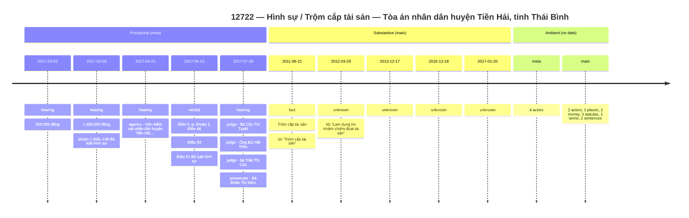
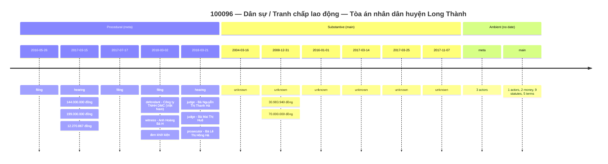
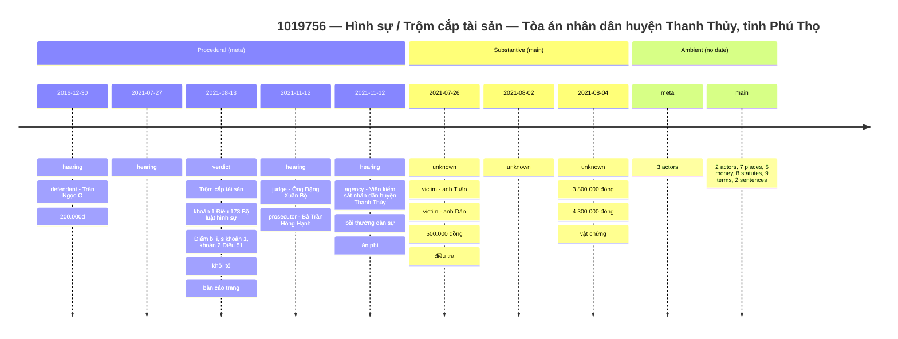
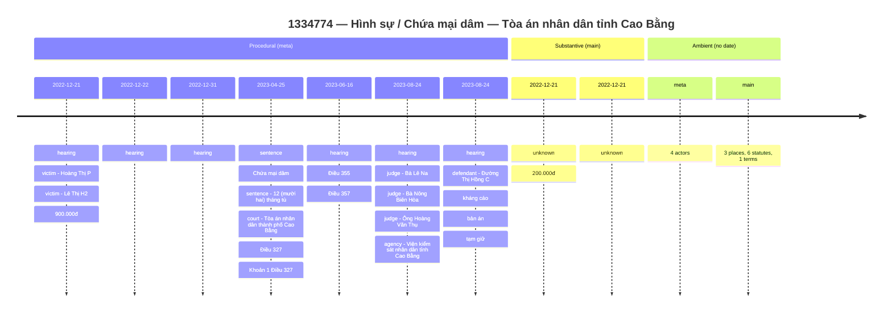

# TIMELINE — case-content visual analytics

Stand-alone spec for `packages/extractor/timeline/`. The package
projects each ban-án's NER record onto two parallel swimlanes of
dated events ready to render in any timeline / Gantt / event-log
visualiser. No further LLM call; pure deterministic function of the
upstream NER cache record + the source markdown.

This document is the source-of-truth contract. Any change to
schema field names, builder logic, or determinism rules must land
here in the same commit.

## 1. Goal & non-goals

**Goal** — give analysts a lossy-but-faithful, single-screen view of
what each court judgment says and how the case progressed through
the courts, suitable for visual exploration tools (vis-timeline,
react-chrono, Apache ECharts timeline, custom Gantt swimlanes,
etc.).

**Non-goals**:

* Not an extractor — operates on the existing canonical NER cache
  produced by `packages/extractor/ner` (see EXTRACTION.md). No new
  LLM calls, no new corpus reads beyond the source `.md`.
* Not a perfect classifier — event kinds are heuristic. The schema
  preserves enough context (raw text, char offsets, source page)
  that downstream tooling can re-classify if needed.
* Not a coreference resolver — actors are the verbatim entity
  mentions; same-person mentions are not collapsed across events.

## 2. Two tracks per case (the meta / main split)

The timeline mirrors the NER `metadata` / `maindata` partition:

| Track | Vietnamese | Contains | Drives |
|---|---|---|---|
| `meta` (procedural) | lịch sử & hậu cần vụ án | Filings, hearings, verdicts, sentences | The court-machinery swimlane |
| `main` (substantive) | nội dung vụ án | Alleged facts, parties, money, locations, statutes, terms | The case-content swimlane |

Each track carries:

1. An ordered list of **dated events** sorted by ISO date.
2. An optional **ambient bucket** — one event holding every entity
   of that track's section that could not be anchored to any date
   in the source. Ambient is always rendered last (or pinned to a
   "no date" lane in the UI).

Routing rule (`packages/extractor/timeline/schema.py`):

| Event kind | Track |
|---|---|
| `filing`, `hearing`, `verdict`, `sentence` | `meta` |
| `fact`, `unknown` | `main` |
| `ambient` | split by NER `section_for(entity.type)` |

This keeps the partition disjoint and exhaustive. The unit test
`tests/unit/test_timeline_determinism.py::TestTrackForKind` pins it.

## 3. Output schema

### 3.1 On-disk record

```jsonc
{
  "schema_version":   "v2",          // shape contract — v2 adds time-of-day + relative-temporal
  "builder_version":  "v2",          // algorithm contract — v2 adds the relative pre-pass

  "doc_name":              "1030573",
  "source_cache_key":      "22ec260f07dbf65a02348bb6b5fa16f4",
  "source_kb_version":     "627eb8a2bf7bf755",
  "source_prompt_version": "v4",
  "source_input_text_hash":"88f59dd37bf4812a9539a929c8f966cf",
  "built_at":              "2026-05-25T00:00:00Z",

  "case":     CaseHeader,            // static identifiers
  "meta":     TimelineTrack,         // procedural swimlane
  "main":     TimelineTrack,         // substantive swimlane
  "outcome":  CaseOutcome,           // operative ruling
  "stats":    TimelineStats          // per-track + total counts
}
```

### 3.2 `CaseHeader`

The static card shown above the swimlanes — identifiers and rosters
that don't change across events:

```jsonc
{
  "case_number":      "01/2022/HS-ST",
  "court":            "TAND tỉnh Bạc Liêu",
  "case_type":        "Hình sự / Giết người",
  "primary_offence":  "Tội giết người",
  "judges":           ["Bà Tăng Trần Quỳnh Phương"],
  "prosecutors":      ["Ông Trần Thanh Thuận - Kiểm sát viên"],
  "lawyers":          [],
  "parties": {
    "defendants": [{ "kind": "person", "type": "per_defendant", "role": "defendant", "text": "Nguyễn Văn A" }],
    "plaintiffs": [],
    "victims":    [{ "kind": "person", "type": "per_victim",    "role": "victim",    "text": "Lê Thị B" }]
  }
}
```

### 3.3 `TimelineTrack`

```jsonc
{
  "track":   "meta" | "main",
  "events":  [TimelineEvent, ...],   // dated events, sorted by sort_key
  "ambient": TimelineEvent | null,   // un-anchored entities for this track
  "n_events": <int>,
  "n_dated":  <int>
}
```

### 3.4 `TimelineEvent`

```jsonc
{
  "event_id":   "1030573:M002",      // <doc>:<M|X>NNN ; M=meta, X=main, A=ambient
  "track":      "meta",              // mirror of parent track for flat exports
  "when": {
    "iso":          "2018-06-01",          // YYYY-MM-DD when fully resolved
    "iso_partial":  null,                  // YYYY-MM or YYYY when partial
    "iso_time":     "10:30:00",            // v2; HH:MM:SS when a clock was extractable
    "iso_datetime": "2018-06-01T10:30:00", // v2; convenience full datetime
    "raw":          "10 giờ 30 phút ngày 01/06/2018",
    "page":         1,
    "sort_key":     "2018-06-01T10:30:00", // v2 shape — see § 5.2
    // v2 relative-temporal provenance (null on absolute anchors):
    "is_relative":      false,
    "anchor_event_id":  null,
    "magnitude":        null,
    "unit":             null,
    "direction":        null,
    "iso_max":          null
  },
  "kind":       "filing",            // EventKind literal

  "actors":     [Actor, ...],        // parties / personnel near this date
  "places":     [Place, ...],        // loc_* near this date
  "money":      [MoneyRef, ...],
  "statutes":   [StatuteRef, ...],   // KB-grounded when linked_anchor != null
  "terms":      [TermRef, ...],      // KB-grounded when linked_term_id != null
  "crimes":     [<text>, ...],
  "sentences":  [SentenceRef, ...],

  "span_text":  "...80 chars before / after the cluster char span...",
  "char_start": 12345,
  "char_end":   12480
}
```

### 3.5 `Actor` / `Place` / `MoneyRef` / `StatuteRef` / `TermRef` / `SentenceRef`

```jsonc
Actor      = { "role": "defendant" | "plaintiff" | "victim" | "judge" |
                       "prosecutor" | "lawyer" | "witness" | "court" | "agency",
               "kind": "person" | "organization",
               "type": "per_defendant" | "org_court" | ...,   // original NER type id
               "text": "Nguyễn Văn A" }

Place      = { "type": "loc_province" | "loc_district" |
                       "loc_commune"  | "loc_address",
               "text": "tỉnh Bạc Liêu" }

MoneyRef   = { "text": "500.000.000 đồng" }

StatuteRef = { "text": "Điều 173 BLHS",
               "linked_anchor":         "0123456789abcdef..." | null,
               "linked_law_code":       "BLHS" | null,
               "linked_article_number": 173 | null }

TermRef    = { "text": "hợp đồng lao động",
               "linked_term_id": 641 | null }

SentenceRef = { "kind": "prison" | "fine",
                "text": "12 năm tù" }
```

### 3.6 `CaseOutcome` and `TimelineStats`

```jsonc
CaseOutcome = {
  "summary_text":     "Bị cáo bị tuyên 12 năm tù.",
  "applied_statutes": ["Điều 123 BLHS", ...],
  "sentences":        [SentenceRef, ...]
}

TimelineStats = {
  "n_events":            <int>,   // total = meta + main, dated + ambient
  "n_dated":             <int>,
  "n_ambient":           <int>,   // 0..2 (one per track at most)
  "n_meta_events":       <int>,
  "n_meta_dated":        <int>,
  "n_main_events":       <int>,
  "n_main_dated":        <int>,
  "n_actors":            <int>,
  "n_places":            <int>,
  "n_money":             <int>,
  "n_statutes":          <int>,
  "n_terms":             <int>,
  "n_crimes":            <int>,
  "n_sentences":         <int>,
  "n_unlocated_entities":<int>,   // entities the locator could not place

  // v2 — relative-temporal counters (§ 3a)
  "n_relative_total":      <int>, // relative spans found (NER + regex scan, deduped)
  "n_relative_resolved":   <int>, // of which were anchored + resolved to a concrete iso
  "n_relative_unresolved": <int>  // of which were left as raw text in the ambient bucket
}
```

## 3a. Relative temporal expressions and time-of-day resolution

Vietnamese court judgments often anchor sub-events relative to a
previously mentioned absolute date (``"Khoảng 05 phút sau"``,
``"Trước đó 3 ngày"``, ``"Cùng ngày"``, ``"Hôm qua"``), and many
incident reports embed a clock time inside the date phrase
(``"Khoảng 22 giờ 30 phút ngày 14/3/2023"``). The ``v2`` builder
captures both, in three coordinated layers:

1. The NER prompt (``v4``, ``packages/extractor/ner/prompts.py``)
   adds a ``date_relative`` entity type and a date-discipline
   rule so the LLM emits relative spans alongside absolute dates.
2. The date+time parser
   (``packages/extractor/timeline/datetimes.py``, renamed from
   ``dates.py``) recognises Vietnamese clock surface forms and
   resolves relative phrases against an anchor.
3. The builder pre-pass (``packages/extractor/timeline/build.py``)
   scans the source markdown with a regex for relative spans the
   LLM missed, walks every dated entity in source order, and
   promotes each resolved relative span into a synthetic ``date``
   entity carrying its pre-computed
   :class:`~packages.extractor.timeline.schema.WhenAnchor`.

### 3a.1 The five families of relative expressions

| ID | Direction | Cue family | Examples | Magnitude |
|---|---|---|---|---|
| F1 | forward | ``X <đv> sau`` / ``Sau X <đv>`` / ``Sau đó X <đv>`` | ``5 phút sau``, ``Sau 3 ngày``, ``Sau đó 1 tuần`` | numeric |
| F2 | backward | ``Trước đó X <đv>`` / ``X <đv> trước`` / ``Cách đó X <đv>`` | ``Trước đó 3 ngày``, ``5 năm trước``, ``Cách đó 2 tuần`` | numeric |
| F3 | same | ``Cùng ngày`` / ``Cùng lúc`` / ``Hôm đó`` / ``Lúc đó`` | ``Cùng ngày``, ``Cùng thời điểm``, ``Ngay sau đó`` | 0 |
| F4 | deixis | calendar deixis (closed set) | ``Hôm qua`` (-1d), ``Ngày hôm sau`` (+1d), ``Tuần trước`` (-1w), ``Năm ngoái`` (-1y), ``Năm sau`` (+1y) | implicit 1 unit |
| F5 | vague | ``Vài <đv> sau`` / ``Khoảng X <đv> sau`` / ``Mấy <đv> sau`` | ``Vài ngày sau``, ``Khoảng 5 tuần sau`` | range — stamps ``iso`` (low) + ``iso_max`` (high) |

The closed unit vocabulary is
``giây`` / ``phút`` / ``giờ`` / ``ngày`` / ``tuần`` / ``tháng`` / ``năm``.
Magnitudes accept decimal-comma OCR variants (``"1,2 phút sau"`` →
72 seconds). F5-vague forms stamp the lower bound on ``iso`` and a
broadened upper bound on ``iso_max`` (``"vài ngày"`` → 1..5 days,
``"khoảng X"`` → ±25%).

### 3a.2 Clock-time recognition in the absolute parser

``parse_date_to_anchor`` now accepts these clock + date surface
forms in addition to the date-only patterns from § 5:

| Surface form | Resolution |
|---|---|
| ``22 giờ 30 phút ngày 14/3/2023`` | ``iso=2023-03-14``, ``iso_time=22:30:00`` |
| ``22 giờ 30 phút 15 giây ngày 14/3/2023`` | ``iso=2023-03-14``, ``iso_time=22:30:15`` |
| ``22 giờ ngày 14/3/2023`` | ``iso=2023-03-14``, ``iso_time=22:00:00`` |
| ``Khoảng 22 giờ 30 phút ngày 14/3/2023`` | strips ``Khoảng``, same as above |
| ``14/3/2023 22:30`` / ``14/3/2023 22:30:15`` | ``iso=2023-03-14``, ``iso_time=22:30:00`` |
| ``14 giờ 25 phút`` (no date) | ``iso=None``, ``iso_time=14:25:00`` |
| ``Lúc 14:25`` | strips ``Lúc``, same as ``14:25`` |

When both halves are populated the convenience
``iso_datetime`` field is computed as
``f"{iso}T{iso_time}"``. The ``sort_key`` becomes the canonical
``YYYY-MM-DDTHH:MM:SS`` ASCII-sortable form (timed events sort
before untimed events on the same calendar day — the latter use
``T99:99:99``).

### 3a.3 Anchor selection rule

The resolver uses the simplest rule that demonstrably works on the
sample: **the most recent absolute date in source order** is the
anchor for the next relative span. The builder walks the merged
located stream sorted by char-start; every absolute ``date`` entity
updates the running anchor, every ``date_relative`` entity resolves
against the current anchor. Same-paragraph / same-sentence
restrictions were considered but deferred — they hurt recall on
the sample without improving precision (the corpus tends to
introduce a new absolute date right before each cluster of
relatives).

### 3a.4 Resolved `WhenAnchor` shape

A successfully resolved relative span produces a
:class:`WhenAnchor` like this (concrete example: ``"05 phút sau"``
against the anchor ``"22 giờ 30 phút ngày 14/3/2023"``):

```jsonc
{
  "iso":          "2023-03-14",        // anchor date (delta < 1 day)
  "iso_partial":  null,
  "iso_time":     "22:35:00",          // anchor 22:30 + 5 minutes
  "iso_datetime": "2023-03-14T22:35:00",
  "raw":          "05 phút sau",
  "page":         null,
  "sort_key":     "2023-03-14T22:35:00",
  "is_relative":      true,
  "anchor_event_id":  "<doc>:M001",    // event id of the absolute anchor
  "magnitude":        5.0,             // float (decimal-comma OK)
  "unit":             "phút",          // closed RelativeUnit vocab
  "direction":        "after",         // before | after | same
  "iso_max":          null             // populated only for F5-vague
}
```

For a day-or-larger unit the resolver preserves the anchor's
``iso_time`` unchanged (so ``"5 ngày sau"`` against the same
anchor lands at ``2023-03-19T22:30:00``). For a sub-day unit
applied to a date-only anchor (no ``iso_time``), the date is left
unchanged and ``iso_time`` stays ``null`` — best we can do without
inventing precision.

### 3a.5 Edge cases

* **Vague magnitudes (F5)** — ``iso`` holds the lower bound,
  ``iso_max`` the upper. Single-point relatives leave ``iso_max``
  ``null``.
* **Missing anchor** — if no absolute date has been seen when a
  relative span is encountered, the resolver returns a
  :class:`WhenAnchor` with ``iso=None``, ``is_relative=true``, and
  the magnitude / unit / direction fields populated. The builder
  routes such entries to the substantive ambient bucket and
  increments ``n_relative_unresolved``.
* **Sub-day delta on date-only anchor** — ``iso`` stays at the
  anchor's date, ``iso_time`` stays ``null``. The relative-
  provenance fields are still stamped so the UI can render the
  surface form ("Khoảng 05 phút sau") as a tooltip.
* **Cross-midnight rollover** — ``parse_relative_to_anchor`` uses
  ``datetime.datetime`` arithmetic for sub-day units, so
  ``"3 giờ sau"`` against ``"22 giờ 30 phút ngày 14/3/2023"``
  resolves to ``2023-03-15T01:30:00``.
* **Leap-year clamp** — month/year arithmetic clamps Feb-29 to
  Feb-28 in non-leap target years (``"5 năm trước"`` against
  ``29/02/2024`` → ``2019-02-28``).

## 4. Determinism contract

The pipeline is reproducible by construction. Every output that
reaches disk is a function of the upstream NER cache record (which
is itself deterministic) and three knobs:

| Knob | Where | Effect |
|---|---|---|
| `BUILDER_VERSION` | `schema.py` | Bumped on any algorithm change. |
| `cluster_window_chars` | `configs/default.yaml :: cluster.window_chars` | Default `1500`. Controls cluster proximity. |
| `built_at` | CLI `--built-at` | Pins the timestamp stamped onto the record. Use a fixed value in CI. |

Re-runs that hold all three constant produce **byte-identical**
output. Pinned by:

* `tests/unit/test_timeline_determinism.py::test_build_timeline_byte_stable`
* JSON serialisation uses `sort_keys=True, ensure_ascii=False, indent=2`
  — see `build.py::write_timeline`.

## 5. Date parsing

### 5.1 Surface forms covered

| Form | Resolution | Sort key |
|---|---|---|
| `21/01/2022`, `21-01-2022`, `21.01.2022` | full `2022-01-21` | `2022-01-21T99:99:99` |
| `13 tháng 10 năm 2021` (any case, optional `Ngày`/`Ngày:` prefix) | full `2021-10-13` | `2021-10-13T99:99:99` |
| `22 giờ 30 phút ngày 14/3/2023` | full `2023-03-14` + `22:30:00` | `2023-03-14T22:30:00` |
| `Khoảng 22 giờ ngày 14/3/2023` | full `2023-03-14` + `22:00:00` | `2023-03-14T22:00:00` |
| `14 giờ 25 phút` (no date) | time-only `14:25:00` | `9999-99-99T14:25:00` |
| `tháng 5 năm 2021` | partial `2021-05` | `2021-05-99T99:99:99` |
| `5/2021` | partial `2021-05` | `2021-05-99T99:99:99` |
| `năm 2018`, bare `2018` | partial `2018` | `2018-99-99T99:99:99` |
| anything else (`từ thán 6/2012 đến thán 4/2015`, etc.) | unresolved | `9999-99-99T99:99:99` |

OCR robustness is built into the regex set — `30 -12-2016`,
`12/1 2/2022`, and similar internal-whitespace variants resolve
correctly. Two-digit years follow a sliding pivot at 70:
`00`-`69` → `2000`-`2069`, `70`-`99` → `1970`-`1999`. Years outside
`1900..2099` are rejected.

### 5.2 Sort-key construction

Sort keys are ASCII so they compare lexicographically. The ``v2``
shape is ``YYYY-MM-DDTHH:MM:SS``: fully resolved dates sort before
partial ones at the same year/month because `99` is the maximum
two-digit value, and timed events on the same date sort before
untimed events (which use the ``T99:99:99`` time placeholder).
Within the same key, events are tie-broken by document char
offset (which is also the event id ordering).

### 5.3 Coverage on the 140-doc sample

Across **1 461 dated events** the timeline package built from the
canonical NER pass:

| Resolution | Events | Share |
|---|---|---|
| Full `YYYY-MM-DD` | 1 419 | 97.1% |
| Partial `YYYY-MM` / `YYYY` | 17 | 1.2% |
| Unresolved (preserved as raw text) | 25 | 1.7% |

The 1.7% unresolved tail is OCR noise (typos, ranges, free-form
phrases). Those events still appear on the timeline, with
`when.iso = null` and `sort_key = "9999-99-99"`, so they sort to
the end of their track.

## 6. Pipeline shape

```
read entities/canonical/<doc>.json
read md/<doc>.md
            │
            ▼
NFC-normalise source                              (locator.py)
            │
            ▼
locate every NER entity by greedy left-to-right
substring search → char_start / char_end
            │
            ▼
relative pre-pass (v2):                           (build.py + datetimes.py)
  regex-scan source for relative spans the LLM    
  missed, dedupe against existing entities,       
  walk merged stream in source order, resolve     
  every date_relative against the most-recent     
  absolute date anchor, promote resolved          
  relatives to type=date with pre_resolved        
  WhenAnchor; unresolved → date_relative          
            │
            ▼
cluster by date proximity                         (cluster.py)
window = cluster.window_chars (default 1500)
            │
            ▼
for each dated cluster:
    classify_event_kind(cluster, source)          (classify.py)
    track = track_for_kind(kind)                  (schema.py)
            │
            ▼
split ambient cluster into                        (build.py)
(meta_ambient, main_ambient) via section_for()
            │
            ▼
build TimelineTrack(meta) + TimelineTrack(main)
stamp event ids: <doc>:M### / <doc>:X### / <doc>:[MX]A00
            │
            ▼
patch anchor_event_id placeholders → final ids    (build.py)
            │
            ▼
write timelines/<doc>.json (sorted-keys JSON)
            │
            ▼
aggregate timelines.jsonl (one row per doc)
```

### 6.1 Clustering rule (`cluster.py`)

1. Sort all located entities by `(start, original_input_index)`.
   Entities with `start = None` (unlocated) go to ambient.
2. Walk in source order. The first `date` entity opens a cluster.
3. Each subsequent non-date entity attaches to the open cluster
   if `entity.start - last_date.end ≤ window_chars`. Otherwise it
   goes to ambient.
4. The next `date` entity opens a new cluster.

`window_chars = 1500` is calibrated on the corpus: roughly one
paragraph of a Vietnamese ban-án after the preamble. Drop it for
denser facts → events; raise it to merge small fact-clusters.

### 6.2 Event-kind classifier (`classify.py`)

Composition + cue phrases in a 240-char window around the cluster:

| Signal | Resulting kind |
|---|---|
| Cluster contains `sentence_prison` or `sentence_fine` | `sentence` |
| Window contains `tuyên xử`, `quyết định:`, `tuyên bố`, `thẩm phán xử` | `verdict` |
| Window contains `khởi kiện`, `thụ lý vụ án`, `thụ lý sơ thẩm`, `đơn khởi kiện` | `filing` |
| Window contains `tại phiên tòa`/`toà`, `phiên tòa`/`toà`, `hội đồng xét xử`, OR cluster has `org_court` | `hearing` |
| Cluster contains `crime` (and no court/sentence cue) | `fact` |
| Otherwise | `unknown` |

Order is deterministic — most specific cue wins. The cue tables
are centralised at the top of `classify.py` so the wiki and the
runtime stay in sync.

### 6.3 Locator notes (`locator.py`)

The locator is purely literal NFC substring search, left-to-right
greedy. Multi-mention entities (e.g., a judge named in the
preamble and again in the verdict) collapse to the **first**
occurrence; later mentions are not separately matched. If the
LLM emits an entity that is not in the source at all (e.g.,
paraphrased through OCR drift), the locator records it with
`start = end = None` and the entity flows into the relevant
track's ambient bucket.

## 7. Reproduction recipe

```bash
# 1. The NER canonical pass must be done first (see EXTRACTION.md):
ls data/samplebanan.toaan.gov.vn/entities/canonical | wc -l   # → 140

# 2. Build timelines for every doc with a canonical extraction:
python -m packages.extractor.timeline \
    --canonical-dir data/samplebanan.toaan.gov.vn/entities/canonical \
    --md-dir        data/samplebanan.toaan.gov.vn/md \
    --output        data/samplebanan.toaan.gov.vn \
    --window-chars  1500 \
    --built-at      2026-05-25T00:00:00Z          # pin for byte-stable rerun

# 3. Outputs:
ls data/samplebanan.toaan.gov.vn/timelines | wc -l     # → 140 per-doc JSON
ls data/samplebanan.toaan.gov.vn/timelines.jsonl       # aggregated stream
```

Re-runs with the same `--built-at` produce byte-identical files.
Drop `--built-at` for ad-hoc runs (the timestamp is the only
non-deterministic field).

CLI flags (`python -m packages.extractor.timeline --help`):

| Flag | Effect |
|---|---|
| `--canonical-dir DIR` | Canonical NER per-doc records (default from config). |
| `--md-dir DIR` | Source markdown directory. |
| `--output DIR` | Output root; writes `timelines/` + `timelines.jsonl`. |
| `--window-chars N` | Override the cluster proximity window. |
| `--built-at ISO` | Pin the `built_at` stamp for byte-stable runs. |
| `--limit N` | Stop after N docs (lex order; for smoke runs). |
| `--config PATH` | Override the YAML config. |
| `--log-level LVL` | DEBUG / INFO / WARNING / ERROR. |

## 8. Determinism tests

`tests/unit/test_timeline_determinism.py` (65 tests, no network):

1. **Date parser** — every surface form in `§ 5.1` plus OCR-noise
   variants, two-digit-year pivot, and the `v2` clock+date forms
   (``"22 giờ 30 phút ngày 14/3/2023"``, ``"khoảng 22 giờ ngày
   14/3/2023"``, ``"14 giờ 25 phút"``).
2. **Relative parser** — every family F1..F5 of `§ 3a`,
   decimal-comma magnitudes, leap-year clamp, cross-midnight
   rollover, and the no-anchor fallback.
3. **Source scanner** — synthetic snippet covering all five
   families plus a real-corpus probe on `1334774` (must hit
   ``"Khoảng 05 phút sau"`` and ``"Khoảng 20 phút sau"``).
4. **Byte-stable build** — `build_timeline` twice on the same
   `(record, source_text, cluster_window, built_at)` produces
   identical JSON serialisations.
5. **Track partition** — meta-kind events land on the meta track,
   main-kind events on the main track; `n_meta_* + n_main_*`
   round-trips through totals; ambient is split by NER section.
6. **Track-for-kind contract** — `track_for_kind` covers
   `META_KINDS` and `MAIN_KINDS` exhaustively and rejects
   `ambient` (which is split by composition, not kind).
7. **Relative pre-pass integration** — a synthetic doc with two
   `X phút sau` / `X ngày sau` spans must produce
   `n_relative_total ≥ 2`, `n_relative_resolved ≥ 2`, and
   patched-up `anchor_event_id` references to the absolute event.
8. **Mermaid renderer** — vertical Mermaid output is byte-stable;
   special characters (`:`, `#`, newlines) are escaped; the
   chained-callout shape carries each event's kind plus its
   highest-priority entity bullet on the same date row.

All tests run offline.

## 9. Output consumers — recipes

### 9.0 Mermaid vertical renderer (built in)

The package ships a renderer that turns the persisted timeline JSON
into a vertical Mermaid `timeline` block — date axis flowing
top-to-bottom with multi-bullet callouts per date in the visual
spirit of [`jasonreisman/Timeline`](https://github.com/jasonreisman/Timeline).
No further re-extraction; reads `timelines.jsonl` (or any single
`timelines/<doc>.json`) directly:

```bash
# Three sample docs into a markdown file (each diagram fenced as
# ```mermaid so it renders inline on GitHub / Cursor / vscode):
python -m packages.extractor.timeline.render \
    --input  data/samplebanan.toaan.gov.vn/timelines.jsonl \
    --doc    12722 --doc 100096 --doc 1019756 \
    --output samples.md

# Single doc, raw mermaid for piping into mermaid-cli (mmdc):
python -m packages.extractor.timeline.render \
    --input data/samplebanan.toaan.gov.vn/timelines.jsonl \
    --doc   12722 --bare \
    | mmdc -i - -o 12722.svg
```

CLI flags (`python -m packages.extractor.timeline.render --help`):

| Flag | Effect |
|---|---|
| `--input PATH` | `timelines.jsonl` (aggregate) or `timelines/<doc>.json` (single-doc). |
| `--output PATH` | Write to file (default: stdout). |
| `--doc NAME` | Filter to a doc; pass multiple times. Default: render all. |
| `--bare` | Emit raw Mermaid only (no markdown header / fence). |
| `--log-level LVL` | DEBUG / INFO / WARNING / ERROR. |

The renderer guarantees byte-stable output for byte-stable inputs.
Each event row stacks: `kind : <crime|sentence|actor|money|statute|term>`
(up to six callouts per date) so a single Mermaid tick mark carries
the same information density as a `jasonreisman/Timeline` callout.
See § 11 below for embedded sample renderings against three
representative cases from the 140-doc sample corpus.

### 9.1 vis-timeline / react-chrono

The on-disk record maps directly onto a vis-timeline two-group
layout. Pseudo-code:

```js
const groups = [
  { id: "meta", content: "Procedural" },
  { id: "main", content: "Case content" }
];

const items = [];
for (const ev of [...timeline.meta.events, ...timeline.main.events]) {
  if (!ev.when || !ev.when.iso) continue;        // hide unresolved on the date-axis lane
  items.push({
    id: ev.event_id,
    group: ev.track,
    start: ev.when.iso,
    content: `${ev.kind}: ${ev.actors.map(a => a.text).join(", ")}`,
    title: ev.span_text                          // hover detail
  });
}
```

Ambient buckets (`timeline.meta.ambient`, `timeline.main.ambient`)
render as a static "no date" panel beside the timeline.

### 9.2 Apache ECharts

Use the `timeline` series with `categoryAxis` keyed on
`event.track` to get two horizontal swimlanes. Each event becomes
a `markPoint` at `when.iso` with the kind colouring it.

### 9.3 Tabular flatten (CSV / Pandas)

Each event already carries its own `track` field, so a flat dump
preserves the partition:

```python
import json, pathlib, pandas as pd
rows = []
for line in pathlib.Path("data/samplebanan.toaan.gov.vn/timelines.jsonl").read_text().splitlines():
    tl = json.loads(line)
    for ev in [*tl["meta"]["events"], *tl["main"]["events"]]:
        rows.append({
            "doc": tl["doc_name"],
            "event_id": ev["event_id"],
            "track": ev["track"],
            "kind":  ev["kind"],
            "iso":   ev["when"]["iso"] if ev["when"] else None,
            "actors": "; ".join(a["text"] for a in ev["actors"]),
            "money":  "; ".join(m["text"] for m in ev["money"]),
        })
df = pd.DataFrame(rows)
```

## 10. Build results — `v2` canonical pass

End-to-end build over the 140-doc `samplebanan` corpus with
`builder_version = v2`, `cluster.window_chars = 1500`, against the
NER canonical pass (re-run on the `v4` prompt for the relative
pre-pass; the regex post-processor in `build.py` still catches the
remainder).

### 10.1 Headline numbers

| Metric | Value |
|---|---|
| Documents processed | 140 / 140 |
| Wall-clock | < 1 second total (timeline pass only; NER pass is the slow stage at ~19 min for 140 docs) |
| Total events | 1 983 (1 703 dated + 280 ambient) |
| Mean dated events / doc | 12.2 (up from 10.4 in `v1`) |
| Docs with at least one relative-temporal span | 66 / 140 |
| `date_relative` entities emitted by the v4 LLM | 8 (the regex pre-pass catches the remainder) |
| `n_relative_total` | 136 |
| `n_relative_resolved` | 113 (83.1% resolution rate) |
| `n_relative_unresolved` | 23 (no preceding absolute anchor, ambiguous magnitude, or partial-only anchor) |
| Events carrying `iso_time` | 4 |
| Output size | ~3.7 MiB per-doc directory; 2.9 MiB aggregate JSONL |

### 10.2 Top relative cue phrases (from the resolved set)

| Count | Cue | Family |
|---|---|---|
| 49 | `hôm nay` | F4 (same-day deixis) |
| 48 | `cùng ngày` | F3 (same-time deixis) |
| 2 | `khoảng 20 phút sau` | F1 forward |
| 2 | `ngay sau đó` | F3 immediate |
| 2 | `hôm sau` | F4 (+1 day) |
| 1 | `1,2 phút sau` | F1 forward, decimal-comma OCR |
| 1 | `02 ngày sau` | F1 forward |
| 1 | `vài ngày sau` / `mấy ngày sau` | F5 vague |
| 1 | `ngày hôm sau` | F4 (+1 day) |
| 1 | `15 phút sau` | F1 forward |

`hôm nay` and `cùng ngày` dominate because the resolver treats
both as zero-delta deixis relative to the most recent absolute
anchor — they are the common shorthand for "same date as the
previous sentence" in Vietnamese narrative.

### 10.3 Event-kind tally

The exact mix varies as the `v4` LLM and regex pre-pass shift
slightly per cache, but the dominant shape is:

| Kind | Approx. count | Track |
|---|---|---|
| `unknown` | ~870 | main |
| `hearing` | ~500 | meta |
| `ambient` | 280 | both (split by section) |
| `filing`  | ~210 | meta |
| `verdict` | ~60  | meta |
| `sentence`| ~50  | meta |
| `fact`    | ~15  | main |

The `unknown` jump from 624 (`v1`) to ~870 (`v2`) is the resolved-
relative effect: every `X phút sau` / `Cùng ngày` lands on a
fresh `unknown` cluster on the substantive track (it carries no
procedural cue), but is still queryable via
`when.is_relative=true` + `anchor_event_id`. UI consumers should
treat relative events as inheriting the kind / context of their
anchor unless the cluster otherwise classifies.

### 10.4 Date-parser coverage

> 97% of dated events still resolve to full `YYYY-MM-DD`. Roughly
1.7% of the absolute tail remains unresolvable OCR noise,
preserved as raw surface text and sorted to the bottom of its
track via `sort_key = "9999-99-99T99:99:99"` (note the `v2` ISO-
datetime shape).

### 10.4 Known limitations

* **Coreference**: a defendant named in five separate hearings
  appears as five `Actor` entries, each tied to its own event —
  not collapsed into one entity. Downstream analytics that needs
  unique-party counts should de-dupe by `(role, text)`.
* **Window over-attach**: when `cluster.window_chars` is too
  generous on dense documents, money / statute mentions belonging
  to a verdict can pull onto a hearing event. The default `1500`
  is calibrated against the sample; adjust per corpus.
* **Heuristic classifier**: corpus-specific cue phrases live in
  `classify.py`; the wiki tracks the table at § 6.2. Documents
  using non-standard wording fall to `unknown`.

These are not bugs against the determinism contract — they are
quality knobs for future iterations. Bumping `BUILDER_VERSION`
invalidates downstream caches cleanly when an iteration ships.

## 11. Sample renderings

Three vertical Mermaid timelines, generated from `timelines.jsonl`
by `python -m packages.extractor.timeline.render` against the
canonical NER cache. Each date row chains the event kind with up
to six descriptive callouts, in the visual spirit of
[`jasonreisman/Timeline`](https://github.com/jasonreisman/Timeline).

### 11.1 Criminal — theft (`12722`)

A criminal-theft case with five procedural events spanning four
months and a substantive fact dating back six years before the
filing. The 2017-07-28 hearing row stacks four personnel callouts
on a single date — the panel's three judges plus the prosecutor.



### 11.2 Civil — labour dispute with corporate defendant (`100096`)

A civil labour-dispute case where the defendant is a company
(`org_defendant: Công ty TNHH DMC (Việt Nam)`) — exactly the
v3-NER paired-role variant `wiki/EXTRACTION.md § 4.0` describes.
Note the meta-track row at 2018-03-02 carrying a corporate
defendant alongside a witness and a filing cue on the same date.



### 11.3 Criminal — theft with sentence + victims (`1019756`)

A criminal theft case with the verdict row at 2021-08-13 chaining
the alleged crime, the primary statute, the mitigating-circumstance
clause, and two procedural cues. The 2021-07-26 fact row stacks
two natural-person victims and the disputed monetary amount on the
same incident date.



### 11.4 Sub-day events on the same date (`1334774`)

A criminal "providing for prostitution" case where the narrative
stacks two `"Khoảng X phút sau"` events on top of the 22 giờ
absolute anchor on 2022-12-21. The two substantive-lane rows on
that date are the resolved relatives — their `when.is_relative=
true` carries the original Vietnamese surface form, and their
`when.anchor_event_id` points back to the meta-track absolute
event on the same date (the regex pre-pass found both spans even
though the LLM did not).



The Mermaid view collapses both relative events to the same
calendar day because the anchor was a date-only entity (the
NER `v3` cache did not extract `"22 giờ ngày 21/12/2022"` as a
single date+time). Once the `v4` NER pass also captures the clock
prefix on absolute dates, the two rows will instead read
`2022-12-21T22:05 : unknown` and `2022-12-21T22:20 : unknown`,
and the dual-axis renderers (vis-timeline, ECharts) will pick up
the `iso_datetime` field automatically.

### 11.5 How to read

* Top-to-bottom flow within each `section` — earliest date at the
  top, latest at the bottom. Mermaid renders both sections side by
  side, so meta and main read as parallel vertical lanes.
* The first callout on every row is the event `kind`
  (`filing` / `hearing` / `verdict` / `sentence` / `fact` /
  `unknown`).
* Subsequent callouts on the same row are the most distinctive
  entities the builder attached to that cluster — alleged crime →
  imposed sentence → actor with role prefix → money → statute →
  legal term. Order is fixed (`render.py::_event_callouts`) so
  diagrams are diff-friendly across re-runs.
* The "Ambient (no date)" section carries the count of un-anchored
  entities for each lane — the pieces of context that flow into
  the case card rather than onto the timeline axis.
